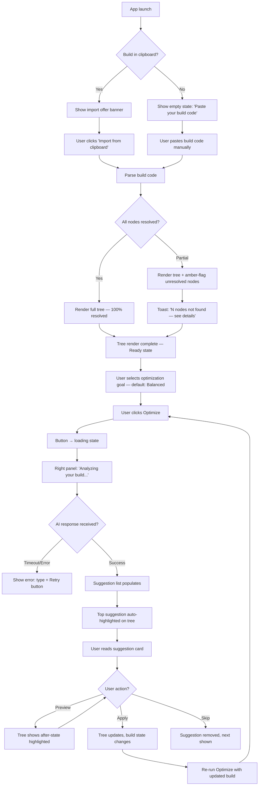
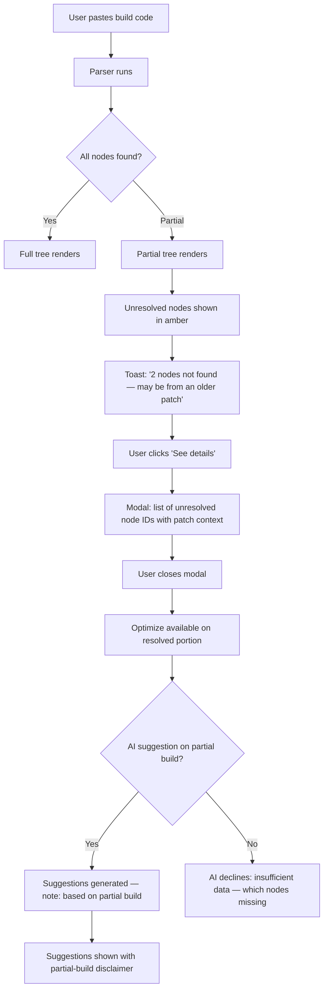
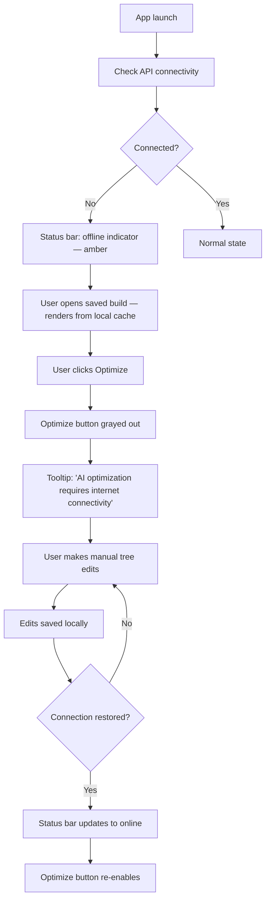

# UX Design Specification — LEBOv2 (Last Epoch Build Optimizer)

**Author:** Alec
**Date:** 2026-04-18

---

## Executive Summary

### Project Vision

LEBOv2 is an AI-powered desktop build optimizer for Last Epoch. It answers a question no existing tool does: *"Given my current build, what are the highest-impact changes I should make right now — and by exactly how much will each change improve my character?"*

The product is a local desktop application (Tauri preferred) that lets advanced players import or build their skill tree, select an optimization goal, and receive ranked AI suggestions each with quantified before/after scoring. The skill tree visualizer is the hero UI element — fully interactive, full-fidelity, and the surface through which all AI suggestions are presented.

### Target Users

**Primary persona: The Min-Maxer**
Advanced Last Epoch players with 100+ hours who understand the game's systems deeply. They are frustrated by static build templates that don't account for their specific character state. They use multiple tools simultaneously (lastepochtools, Maxroll, community Discord builds) and apply manual judgment to reconcile them. This is slow, error-prone, and produces no quantifiable feedback loop.

**Secondary persona: The Theory-Crafter**
Veteran ARPG players starting a new class or experimenting with non-meta builds. They want to understand *why* a build works, not just copy a template. They iterate: build → optimize → adjust → re-optimize.

Both groups are highly technical, keyboard-comfortable, and have internalized the Path of Building (PoE) paradigm — they are not intimidated by dense, data-heavy UIs.

### Key Design Challenges

1. **Tree + AI integration**: The skill tree visualizer and AI suggestion panel must feel like a unified system, not two separate features bolted together. Suggestions must highlight directly on the tree; the tree must be the viewport through which users *act* on suggestions.

2. **Trust and transparency**: Users will not act on unexplained AI recommendations. Every suggestion must include its quantified delta AND its plain-language technical rationale. The scoring model's assumptions must be visible to the community.

3. **Performance as UX**: At 60fps, the tree feels alive and responsive — this IS the UX. Any rendering lag breaks immersion and erodes trust. Performance is a design constraint, not just an engineering one.

4. **Graceful degradation**: The app must feel complete and useful even when the AI is unavailable (offline) or game data is stale. Users should never hit a dead end.

### Design Opportunities

1. **The "aha moment" as product hook**: The first time a user sees their specific build's weaknesses named and ranked with quantified improvement paths, they will evangelize the tool. Design around this moment — make it fast, clear, and emotionally resonant.

2. **Iterative optimization loop**: Unlike competitors that are one-shot tools, LEBOv2 can be used repeatedly as builds evolve. Design for the habit: return → import → optimize → apply → return again.

3. **Data as visual language**: Before/after scoring deltas, damage/survivability/speed axes, node highlight states — the data IS the story. Design a visual language that makes numbers instantly readable at a glance.

---

## Core User Experience

### Defining Experience

The single defining interaction for LEBOv2:

> **"Paste your build code → watch your tree render in seconds → click Optimize → receive ranked AI suggestions with exact node changes and before/after deltas."**

This is the core loop. Everything else — the context panel, the offline mode, the build save/load — serves this loop. If this interaction is fast, trustworthy, and satisfying, the product succeeds.

In the language of famous defining experiences:
- Spotify: "Discover and play any song instantly"
- LEBOv2: **"Tell me exactly what to change in my build and why — right now"**

### Platform Strategy

**Platform:** Desktop-primary (Tauri/Electron). Mouse and keyboard. Minimum supported resolution: 1280×720. Optimal: 1920×1080+.

**Why desktop-first:** The skill tree graph is a large, information-dense canvas that demands screen real estate. Mouse precision enables node-level interaction (click, hover for tooltips, drag to pan). Keyboard shortcuts accelerate power-user workflows. The local-first architecture is a natural fit for desktop.

**Offline capability:** Skill tree viewing and build editing must work fully offline. Only AI optimization requires network. This is a hard requirement — users at LAN parties, in travel, or with intermittent connectivity should not lose access to their builds.

**No mobile in MVP.** The skill tree interaction model is fundamentally incompatible with small touchscreens.

### Effortless Interactions

The following actions must feel completely frictionless — zero cognitive load:

- **Build import**: Paste a build code anywhere in the app (clipboard detection), or use a clearly labeled paste input. The tree renders automatically. No multi-step wizard.
- **Optimization trigger**: One prominent CTA button. No configuration required before first use.
- **Suggestion reading**: Each suggestion card should be scannable in 3 seconds. Delta numbers prominent. Explanation secondary but accessible.
- **Node inspection**: Hover over any node → tooltip appears instantly with name, effect, allocation cost. No click required to see basics.

What should happen automatically without user intervention:
- Clipboard detection on app focus (if a build code is in clipboard, offer to import)
- Data freshness check on launch (non-blocking)
- API connectivity status (ambient indicator, not modal)
- Suggestion preview on card hover (tree highlights affected nodes)

### Critical Success Moments

**Moment 1: The tree renders.** User pastes their build code. Within 3 seconds, their exact skill tree state appears on screen — nodes allocated, connections drawn, matching their in-game character. This is the "it works" moment that establishes trust.

**Moment 2: The first suggestion lands.** Within 30 seconds of clicking Optimize, a ranked list appears. The top suggestion names a specific change, shows "+N% Damage Score (X → Y)", and explains *why* in one sentence referencing actual game mechanics. This is the "aha" moment.

**Moment 3: Applying the suggestion.** User clicks "Preview" on a suggestion → the tree updates visually showing the proposed change. They can see the before and after state side by side. Clicking "Apply" locks in the change. This is the "I did it" moment.

**Failure mode to avoid at all costs:** User triggers optimization, waits 30 seconds, receives vague or obviously wrong suggestions. This is catastrophic. The AI quality is the product's core promise.

### Experience Principles

1. **Tree-first**: Every screen and every decision radiates from the skill tree. The tree is not a component; it is the product.
2. **Show the math**: Numbers are not decoration. Every suggestion shows the delta. Every score is explained. Users trust what they can verify.
3. **Fast or apologize**: If something takes time (AI call, data load), show a meaningful loading state with progress signal. Never go silent.
4. **Fail gracefully, fail visibly**: Offline, stale data, API errors — always surface state clearly. Users should never wonder if the app is broken.
5. **Respect expertise**: These users know the game deeply. Do not over-explain game concepts. Use precise terminology. Trust their judgment when they override suggestions.

---

## Desired Emotional Response

### Primary Emotional Goals

**Core emotion: Empowered**
Users should leave each session feeling like they have a smarter understanding of their build — that they made decisions based on data, not guesswork. The feeling is: *"I know exactly what I'm doing and why."*

**Secondary emotion: Trusted advisor relationship**
The AI should feel like a knowledgeable friend who knows the game mechanics deeply and gives honest, specific advice — not a black box. Users should feel the AI is *on their side*, not trying to impress them with complexity.

### Emotional Journey Mapping

| Stage | User State | Desired Emotion | Design Response |
|-------|-----------|-----------------|-----------------|
| First launch | Uncertain, evaluating | Curiosity → Quick confidence | Fast onboarding, immediate value |
| Build import | Anticipating | Engaged, watching | Smooth render animation, progress signal |
| Waiting for AI | Slightly anxious | Calm, informed | Clear loading state, estimated time |
| First suggestion | Alert, critical | "This makes sense" trust | Clear delta + specific explanation |
| Applying a suggestion | Decided | Accomplishment | Visual tree update, satisfying feedback |
| Returning user | Habitual | Efficient, in control | Fast resume, no re-setup |
| Error state | Frustrated potential | Informed, not abandoned | Clear error message, retry path |

### Micro-Emotions

- **Confidence over confusion**: Every interaction should leave users more certain, not less. Unclear nodes → always show tooltip. Ambiguous suggestion → always explain.
- **Trust over skepticism**: Pre-empt doubt by showing the math. Don't ask users to just believe the AI.
- **Accomplishment over frustration**: Make the path from "build in" to "suggestion applied" feel like a series of small wins, not a grind.
- **Engagement over anxiety during waits**: The 20-30 second AI wait is the highest-anxiety moment. Animated progress, partial results if possible, or at minimum a "thinking..." state with game-themed messaging.

### Design Implications

- **Empowerment → Quantified scoring**: Every number should be readable instantly. Large, high-contrast delta values. Color-coded direction (green = improvement).
- **Trust → Mandatory explanations**: No suggestion ever appears without its rationale. The explanation is part of the suggestion, not an optional tooltip.
- **Accomplishment → Visual feedback**: When a suggestion is accepted, the tree re-renders with the change highlighted. Users see the result of their decision immediately.
- **Calm during wait → Progress state**: Implement a streaming or progressive reveal pattern for AI results where possible. Even seeing the first suggestion appear while others load reduces anxiety.

### Emotional Design Principles

1. Data is confidence, not intimidation — present numbers with context and direction.
2. Every wait needs a reason — show what's happening, not just that something is happening.
3. Success should be visible — make the moment of improvement tangible on the tree.
4. Never leave users stranded — every error has a next step.

---

## UX Pattern Analysis & Inspiration

### Inspiring Products Analysis

**Path of Building (PoB) — Path of Exile**
The gold standard for ARPG build planners. PoB's UX is dense, data-heavy, and beloved by expert users because it respects their expertise. Key lessons:
- Full-fidelity passive tree as primary interface — takes up the majority of screen real estate
- Dense stat panel on the left; users accept cognitive complexity in exchange for data completeness
- Tree interaction: click-to-allocate, hover-for-tooltip, search-to-highlight — all feel natural after minimal learning
- Weakness (our opportunity): No AI layer, no "what should I change" — all analysis is manual

**lastepochtools.com**
The current go-to for Last Epoch players. Functional, browser-based, familiar to our target users. Key lessons:
- Users already know what a Last Epoch tree looks like in a web tool — they have a mental model we can leverage
- The build code paste workflow is established community practice — we must support this exact input format
- Weakness: Static, no optimization suggestions, web-based (slower than desktop)

**Modern analytics/dashboard UIs (Linear, Vercel, etc.)**
Reference for how to present data-heavy interfaces in a dark-mode, developer-adjacent aesthetic. Key lessons:
- Dense data tables with clear hierarchy (primary metric prominent, supporting data secondary)
- Progressive disclosure: summary visible at glance, details on hover/expand
- Status indicators: color + icon + text (never color alone for colorblind accessibility)

### Transferable UX Patterns

**Navigation Patterns:**
- **Tab-based tree switching** (Passive Tree / Skill Trees): PoB-style tabs at the top of the tree viewport. Users expect this from the PoB paradigm.
- **Collapsible side panels**: Allow users to maximize tree real estate by hiding build management or suggestion panels when not needed.

**Interaction Patterns:**
- **Hover-reveal tooltips**: The standard for node inspection — no click required for basic info. Used by every tree-based game tool.
- **Clipboard paste anywhere**: Detect build codes from clipboard on app focus. Eliminate the need to find the "import" button.
- **Preview before commit**: Show the visual result of a suggestion on the tree before applying it. Borrowed from PoB's manual simulation pattern, automated here.

**Visual Patterns:**
- **Dark canvas + bright data**: Dark background for tree canvas (#0f0f0f–#1a1a1a range), with bright node highlights and accent-colored data points. Standard in game tools and analytics dashboards.
- **Color-coded scoring deltas**: Green for improvement, red for regression, neutral for no change. Universal pattern; don't invent a new convention here.
- **Node state visual differentiation**: Allocated (bright, filled), unallocated (dim, outlined), prerequisite-locked (grayed, tooltip explains). Shape AND color (NFR17 requires non-color-only distinction).

### Anti-Patterns to Avoid

- **Modal interruptions during optimization**: Do not show a modal while the AI is working. Use an inline loading state in the suggestion panel. Modals for a 20-30 second wait feel punishing.
- **Unexplained AI suggestions**: Any suggestion without a technical explanation erodes trust immediately. This is an existential anti-pattern for this product.
- **Over-reliance on color for node states**: Many ARPG players have spent hours in dark rooms — color blindness considerations matter. Always pair color with shape or icon.
- **Nested navigation for common actions**: Getting to "Optimize" should always be one click from any state. Don't bury the primary CTA.
- **Full-page loading screens**: The app should feel responsive even when fetching data. Progressive loading is always preferable to a spinner blocking the entire viewport.

### Design Inspiration Strategy

**Adopt:**
- PoB's tree-first layout philosophy — the tree is the primary viewport
- Hover-reveal tooltips for node inspection
- Dense stat panel pattern for the suggestion list
- Dark canvas / bright data color strategy

**Adapt:**
- PoB's manual stat panel → automated AI suggestion cards with delta scoring
- lastepochtools.com build code import → plus clipboard auto-detection
- Analytics dashboard progressive disclosure → applied to AI suggestion expansion

**Avoid:**
- Generic light-mode component library aesthetics (Material, Ant Design defaults)
- Over-simplified mobile-first layout patterns that waste desktop screen real estate
- Confirmation dialogs for reversible in-session actions (just do it, let users undo)

---

## Design System Foundation

### Design System Choice

**Custom-themed system built on Tailwind CSS + Headless UI (React)**

This is a "Themeable System" approach — we use Tailwind as the utility foundation and Headless UI for accessible, unstyled interactive primitives, then build a complete custom visual layer on top that matches the Last Epoch aesthetic.

This is not a standard component library (Material, Ant Design, Chakra) — those impose visual conventions that would clash with the game-inspired aesthetic and feel generic for a community tool.

### Rationale for Selection

- **Visual uniqueness required**: LEBOv2 needs to feel like a premium companion app for Last Epoch, not a generic web dashboard. Off-the-shelf component libraries would immediately read as "template."
- **Solo/small team speed**: Tailwind provides a complete utility system — spacing, color, typography — without writing custom CSS properties. This is faster than pure custom CSS.
- **Performance**: Tailwind's utility-first approach and Headless UI's minimal JavaScript footprint align with the Tauri performance targets (NFR1–6).
- **Accessibility built in**: Headless UI components handle ARIA, keyboard navigation, and focus management by default — directly satisfying NFR15.
- **Canvas/WebGL compatibility**: The skill tree renderer (D3.js, Cytoscape, or custom WebGL) operates outside the component system entirely. The design system handles the shell UI; the tree is its own rendering layer.

### Implementation Approach

**Design Tokens (Tailwind config extension):**

```js
// tailwind.config.js — LEBOv2 design tokens
colors: {
  // Backgrounds
  'bg-base':     '#0a0a0b',   // App background
  'bg-surface':  '#141417',   // Panel/card surface
  'bg-elevated': '#1c1c21',   // Modals, dropdowns
  'bg-hover':    '#252530',   // Interactive hover states

  // Accent — Last Epoch gold
  'accent-gold':   '#C9A84C',
  'accent-gold-soft': '#D4B96A',
  'accent-gold-dim':  '#8B7030',

  // Data colors
  'data-damage':     '#E8614A', // Damage score — warm red
  'data-surv':       '#4A9EE8', // Survivability — cool blue
  'data-speed':      '#4AE89E', // Speed — green
  'data-positive':   '#5EBD78', // Improvement delta
  'data-negative':   '#E85E5E', // Regression delta
  'data-neutral':    '#6B7280', // No change

  // Node states
  'node-allocated':  '#C9A84C', // Gold — allocated
  'node-available':  '#4A7A9E', // Blue-grey — allocatable
  'node-locked':     '#2A2A35', // Dark — prereq locked
  'node-suggested':  '#7B68EE', // Purple — AI suggestion highlight

  // Text
  'text-primary':   '#F0EAE0', // Warm white — primary
  'text-secondary': '#9E9494', // Muted — secondary/labels
  'text-muted':     '#5A5050', // Very muted — disabled/placeholder
}
```

### Customization Strategy

- All interactive states (hover, focus, active, disabled) use the token system — no one-off hex values
- The canvas/tree area uses the token colors for node rendering but operates as its own rendering context (not Tailwind-managed)
- Typography: **Inter** for UI text and data labels; **JetBrains Mono** for numeric scores and delta values (monospace ensures number alignment in suggestion lists)
- Spacing base: 4px (Tailwind default) — dense layouts with consistent rhythm

---

## 2. Core User Experience

### 2.1 Defining Experience

> **"Analyze my build right now — tell me exactly what to change and by how much."**

The core interaction flow is a four-step loop:

1. **Build arrives** → User pastes code or opens saved build
2. **Tree renders** → Full-fidelity skill tree appears in seconds
3. **Optimize** → User selects goal, clicks Optimize
4. **Suggestions delivered** → Ranked list with deltas, user accepts/iterates

This loop is the product. Every design decision must shorten, clarify, or deepen this loop.

### 2.2 User Mental Model

Target users have internalized the Path of Building paradigm. They think of their character as a graph of nodes with associated stats, and they expect a tool that lets them:
- See the complete state of their build visually
- Understand how changing a node affects their stats
- Iterate quickly without friction

They do NOT expect:
- Wizards or guided onboarding (they are experts)
- Explanations of game mechanics they already know
- Confirmation dialogs for reversible actions

**Current workflow we replace:** Open lastepochtools.com → view tree → read Maxroll guide → manually identify potential changes → mental-math the impact → apply changes in-game → repeat. This takes 20–60 minutes per session. LEBOv2 does the analysis in 30 seconds and shows the quantified result.

### 2.3 Success Criteria

- Build import to rendered tree: ≤ 3 seconds (NFR3)
- Optimization results on screen: ≤ 30 seconds (NFR4)
- Top suggestion is immediately scannable: delta value readable in < 1 second
- Explanation answers "why" without requiring the user to know any context outside the card
- User can preview the suggestion effect on the tree before committing

### 2.4 Novel UX Patterns

**Novel — the AI suggestion card with live tree highlighting:**
No existing tool does this. When a user hovers or focuses a suggestion card, the tree highlights the affected nodes (from-nodes dim, to-nodes glow in suggestion purple). This is a new interaction pattern we need to teach users — but it's learnable in one use because it's visually obvious.

**Established — build code paste import:**
This is already the community standard for Last Epoch. We adopt it exactly, adding clipboard auto-detection as a quality-of-life enhancement.

**Established with twist — optimization goal selector:**
Radio button or segmented control for goal selection (Damage / Survivability / Speed / Balanced). Familiar form pattern, but with real-time score preview showing current build's baseline scores for each goal — so users can see which goal has the most headroom before they even click Optimize.

### 2.5 Experience Mechanics

**Build Import Flow:**
1. *Initiation*: User opens app → "Import Build" area prominent at top of left panel, OR clipboard detection offers "Paste build from clipboard?" on app focus
2. *Interaction*: User pastes build code string into text field → app begins parsing immediately (no submit button needed)
3. *Feedback*: Progress bar / "Resolving nodes..." → individual node resolution shown as tree populates
4. *Completion*: Tree fully rendered → build name editable → "Ready to optimize" state visible

**Optimization Flow:**
1. *Initiation*: Optimize CTA button in right panel — always visible, disabled only when no build loaded or offline
2. *Interaction*: User selects optimization goal (defaults to Balanced) → clicks Optimize → button transitions to loading state
3. *Feedback*: Right panel shows "Analyzing your build..." with animated indicator; partial suggestions stream in as AI generates them (if streaming is feasible with Claude API)
4. *Completion*: Ranked suggestion list populated → top suggestion auto-focused → tree highlights suggestion 1 nodes

**Suggestion Interaction:**
1. *Browse*: Scroll suggestion list — each card shows delta summary at a glance
2. *Inspect*: Click/focus a card → card expands with full explanation → tree highlights affected nodes
3. *Preview*: "Preview" button on card → tree shows hypothetical after-state
4. *Accept*: "Apply" button → tree updates to new state → suggestion marked applied → re-run Optimize with updated build
5. *Dismiss*: "Skip" button → suggestion removed from list, not suggested again this session

---

## Visual Design Foundation

### Color System

**Philosophy:** Dark, game-aesthetic base with gold accents and color-coded data visualization. The palette reads as a premium companion app — immersive but data-forward.

**Palette:**

| Role | Token | Hex | Usage |
|------|-------|-----|-------|
| App background | `bg-base` | `#0a0a0b` | Global background |
| Surface | `bg-surface` | `#141417` | Panels, cards |
| Elevated | `bg-elevated` | `#1c1c21` | Modals, popovers |
| Hover | `bg-hover` | `#252530` | Interactive hover |
| Primary accent | `accent-gold` | `#C9A84C` | CTAs, allocated nodes, brand |
| Damage score | `data-damage` | `#E8614A` | Damage axis |
| Survivability | `data-surv` | `#4A9EE8` | Survivability axis |
| Speed | `data-speed` | `#4AE89E` | Speed axis |
| Positive delta | `data-positive` | `#5EBD78` | Improvement indicator |
| Negative delta | `data-negative` | `#E85E5E` | Regression indicator |
| Suggestion highlight | `node-suggested` | `#7B68EE` | AI-suggested nodes |
| Primary text | `text-primary` | `#F0EAE0` | All primary text |
| Secondary text | `text-secondary` | `#9E9494` | Labels, secondary info |

**Semantic mapping:**
- All interactive elements use `accent-gold` as primary color
- Scoring dimensions have consistent colors across all views (always same color for damage, etc.)
- Node states: allocated = gold, available = blue-grey, locked = near-black, AI-suggested = purple

**Accessibility:** All text/background combinations maintain WCAG AA contrast ratio (≥4.5:1 for normal text, ≥3:1 for large text). The `text-primary` on `bg-surface` combo = ~12:1.

### Typography System

**Primary font:** Inter (all UI text, labels, explanations)
- Clean, highly readable at small sizes
- Excellent number rendering
- Free, widely available

**Monospace font:** JetBrains Mono (all numeric scores and delta values)
- Ensures number alignment in suggestion score columns
- Clearly distinguishes numeric data from prose
- Readable at small sizes in dense panels

**Type Scale:**

| Role | Size | Weight | Font | Usage |
|------|------|--------|------|-------|
| Display | 24px | 600 | Inter | Section headers |
| Heading | 18px | 600 | Inter | Panel headers |
| Subheading | 14px | 500 | Inter | Card titles |
| Body | 14px | 400 | Inter | Explanations, descriptions |
| Label | 12px | 500 | Inter | Field labels, tags |
| Data | 16px | 700 | JetBrains Mono | Score values, deltas |
| Data small | 12px | 600 | JetBrains Mono | Secondary numeric values |
| Caption | 11px | 400 | Inter | Timestamps, metadata |

**Line heights:** 1.5 for body text, 1.2 for headings, 1.0 for tabular/monospace data.

### Spacing & Layout Foundation

**Base unit:** 4px (Tailwind default)
**Common spacing rhythm:** 4, 8, 12, 16, 24, 32, 48, 64px

**Layout strategy:** Three-column desktop layout
- Left panel (260px, collapsible): Build management, class/mastery selector, saved builds
- Center (flex-grow): Skill tree canvas — always maximized
- Right panel (320px, collapsible): Optimization goal, AI suggestions, before/after scoring

**Density:** Medium-dense. Data panels are compact (8–12px internal padding on cards) to maximize information density without feeling cramped. Tree canvas has no padding — it fills all available space.

**Grid system:** No strict grid — panels are fixed-width with flex center. Tree canvas uses its own coordinate system.

### Accessibility Considerations

- All text/background combinations WCAG AA compliant (≥4.5:1)
- Node states communicated via shape + fill + color (never color alone) — NFR17 compliance
- Focus indicators: 2px solid `accent-gold` ring on all interactive elements
- Minimum touch/click target: 32×32px for node interaction, 44×44px for all other interactive elements
- High contrast mode: System high-contrast detection → fallback to pure black/white with preserved information hierarchy

---

## Design Direction Decision

### Design Directions Explored

Six directions were evaluated internally based on the project-intent aesthetic requirements and PRD:

1. **Command Center** — Full-screen tree center stage, collapsible panels flanking. Dense, data-forward. PoB-paradigm.
2. **Dashboard Split** — Horizontal split: tree top 60%, suggestion panel bottom 40%. Always-visible suggestions.
3. **Left-heavy** — Tree takes right 70%, left panel always expanded with deep stats.
4. **Focused Mode** — Tree full-screen with floating overlay panels (suggestion drawer slides in from right).
5. **Tabbed Mode** — Tree and suggestions on separate tabs, switching context.
6. **Wizard Mode** — Guided step-by-step flow: import → goal → optimize → review.

### Chosen Direction

**Direction 1: Command Center**

Three-column layout. Tree dominates the center. Left panel manages build context. Right panel shows AI output. Panels are collapsible to maximize tree real estate. This is the layout advanced users expect from the PoB paradigm.

### Design Rationale

- **Tree-first principle**: The tree is the hero. It needs the most pixels. Center placement with flex-grow ensures it always gets what it needs regardless of window size.
- **Mental model alignment**: Min-maxers who use PoB have a hardwired expectation for "tree center, stats around it." Command Center honors this.
- **Wizard Mode rejected**: LEBOv2's users are experts. A wizard flow insults their intelligence and adds friction to every session after the first.
- **Tabbed Mode rejected**: Switching tabs to see suggestions while referencing the tree is a false economy. The whole point of the product is seeing suggestions ON the tree simultaneously.
- **Focused Mode considered**: Floating overlay panels are elegant but create z-index complexity and obscure the tree. Left for a future "focus mode" toggle.

### Implementation Approach

```
┌────────────────────────────────────────────────────────┐
│ [App Header] — LEBOv2 | Build Name | Data version | ⚡  │
├──────────────┬──────────────────────────┬───────────────┤
│ LEFT PANEL   │   SKILL TREE CANVAS      │ RIGHT PANEL   │
│ (260px)      │   (flex-grow)            │ (320px)       │
│              │                          │               │
│ Class/Mastery│   [Interactive tree]     │ Goal selector │
│ Build import │                          │ [Optimize CTA]│
│ Saved builds │   Pan/zoom               │               │
│              │   Node click/hover       │ Suggestion list│
│ Context panel│   AI node highlights     │ Score display │
│ (gear/skills/│                          │               │
│  idols)      │                          │               │
│              │                          │               │
├──────────────┴──────────────────────────┴───────────────┤
│ [Status bar] — API status | Data version | Offline flag  │
└────────────────────────────────────────────────────────┘
```

---

## User Journey Flows

### Journey 1: The Frustrated Min-Maxer (Import & Optimize — Happy Path)

**Persona:** Kira, 28. Falconer Rogue, 300 hours. DPS has plateaued.



**Flow optimizations:**
- Clipboard auto-detect eliminates 2 steps for returning users
- Streaming AI responses (if API supports) show first suggestions before full response
- "Apply" is one click — no confirmation dialog (action is reversible via session state)

---

### Journey 2: The Theory-Crafter (Build from Scratch)

**Persona:** Marcus, 35. New to Forge Guard, won't follow guides.

```mermaid
flowchart TD
    A[App launch] --> B[User selects 'New Build']
    B --> C[Class selector: 5 classes shown]
    C --> D[User selects Sentinel]
    D --> E[Mastery selector: Void Knight, Forge Guard, Paladin]
    E --> F[User selects Forge Guard]
    F --> G[Blank Forge Guard passive tree renders]
    G --> H[User clicks nodes to allocate points]
    H --> I[Node tooltip shows on hover: name, effect, point cost]
    I --> H
    H --> J{Points exhausted?}
    J -- No --> H
    J -- Yes --> K[User selects goal: Balanced]
    K --> L[User clicks Optimize]
    L --> M[AI analyzes 40-node build]
    M --> N[Suggestion list: targeted changes]
    N --> O[User reviews each suggestion]
    O --> P{Accept suggestion?}
    P -- Accept → Q[Apply change to tree]
    P -- Skip --> R[Next suggestion]
    Q --> S{Re-optimize?}
    S -- Yes --> L
    S -- No --> T[Build saved locally]
```

---

### Journey 3: Partial Import / Data Gap

**Persona:** Sam pastes a build from an old patch.



---

### Journey 4: Offline / API Unavailable

**Persona:** Alex at a LAN party with spotty internet.



---

### Journey Patterns

**Navigation Patterns:**
- Panel collapse toggle: chevron button at panel edge — collapses to icon rail (48px)
- Tree navigation: pan (mouse drag), zoom (scroll wheel), node inspect (hover), node action (click)
- Suggestion list: virtual scroll — handles large suggestion sets without DOM bloat

**Feedback Patterns:**
- Build import: Progressive rendering (nodes appear as they resolve) — not "wait then display all"
- AI loading: Animated "thinking" indicator in right panel + estimated time ("usually ~20 seconds")
- Success: Toast notification (top-right, auto-dismiss 4s) + state change in relevant panel
- Error: Inline error in the relevant panel + toast for critical errors

**Decision Patterns:**
- All destructive actions (delete saved build) require explicit confirmation
- All optimization actions are reversible within the session (undo stack for tree state)
- Skip a suggestion: soft removal (visible in a "Skipped" collapsed section)

---

## Component Strategy

### Design System Components

**From Tailwind + Headless UI (use without modification):**
- RadioGroup (optimization goal selector)
- Dialog/Modal (confirmation dialogs, node detail modals)
- Disclosure/Accordion (expandable suggestion explanation)
- Listbox (class/mastery selector dropdowns)
- Tooltip (wrapper for node hover tooltips)
- Switch (settings toggles)
- Tabs (Passive Tree / Skill Trees navigation)
- Toast/Notification (via react-hot-toast or similar)

### Custom Components

These components cannot be sourced from any design system — they are unique to LEBOv2:

---

#### SkillTreeCanvas

**Purpose:** The hero interactive canvas rendering the full passive or skill tree.
**Content:** All skill tree nodes, connections, node allocation states, AI suggestion highlights.
**Actions:** Pan (drag), zoom (scroll), hover (tooltip), click (allocate/deallocate), keyboard navigation between nodes.
**States:** Loading, rendered/idle, rendering-with-suggestions (highlighted nodes), offline (read-only badge), partial-import (amber flagged nodes).
**Variants:** Passive tree mode (large, all class nodes), active skill tree mode (smaller, per-skill nodes).
**Accessibility:** Tab/arrow key navigation between nodes; Enter to allocate; screen reader announces node name + state + effect on focus.
**Implementation note:** Canvas or WebGL renderer (D3/Cytoscape/custom) — must maintain ≥60fps on mid-range hardware (NFR1).

---

#### SuggestionCard

**Purpose:** Presents a single AI optimization suggestion with delta scoring and explanation.
**Content:** Change description (from/to nodes + points), before/after delta scores (3 axes), plain-language explanation, action buttons.
**Actions:** Preview (highlight on tree), Apply (update build), Skip (dismiss).
**States:** Default (collapsed delta summary), Expanded (full explanation visible), Previewing (tree shows after-state), Applied (checkmark, greyed).
**Variants:** Top suggestion (slightly larger, prominent), standard suggestion, skipped suggestion (collapsed footer).
**Accessibility:** Keyboard navigable; Enter to expand; P for preview, A for apply, S for skip; ARIA role=article with descriptive label.

**Anatomy:**
```
┌──────────────────────────────────────────────────────┐
│ [Rank #] Change 4 pts: Efficiency → Falcon Strikes   │
│ ─────────────────────────────────────────────────────│
│ 🗡️ +18%  🛡️ -2%   ⚡ +0%    [42 → 51 Damage Score]  │
│ ─────────────────────────────────────────────────────│
│ "You're not cooldown-capped. Efficiency offers       │
│  diminishing returns; Falcon Strikes directly        │
│  scales your primary damage source."                 │
│ ─────────────────────────────────────────────────────│
│ [Preview]  [Apply]  [Skip]                           │
└──────────────────────────────────────────────────────┘
```

---

#### ScoreGauge

**Purpose:** Displays the current build's composite score across three axes.
**Content:** Numeric score + mini bar for each of Damage, Survivability, Speed; composite score.
**Actions:** None (display only). Hover shows score breakdown tooltip.
**States:** Baseline (current build), Preview (after suggestion applied — comparison mode).
**Variants:** Full (shows all 3 axes), Compact (shows composite only for status bar).
**Accessibility:** Values announced as "Damage score: 42 out of 100" etc.

---

#### BuildImportInput

**Purpose:** Specialized input for accepting and validating a build code string.
**Content:** Text input + import button; resolution progress display.
**Actions:** Paste, Import, Clear.
**States:** Empty, Pasting (parsing in progress), Resolved (full), Partial (with warning), Error (invalid code).
**Accessibility:** Label "Build code"; placeholder "Paste your build code here"; error state announced via aria-live.

---

#### NodeTooltip

**Purpose:** Rich tooltip displayed on node hover showing full node details.
**Content:** Node name, point cost, current allocation, effect description, tags (damage types, ailments), connection requirements.
**Actions:** None (informational only).
**States:** Standard, AI-suggested (purple accent border + "Suggested" label).
**Accessibility:** Triggered by focus as well as hover; content available to screen readers via aria-describedby.

---

#### ContextPanel

**Purpose:** Read-only display of gear, active skills, and idol data provided as AI optimization context.
**Content:** Gear slots (with affix summary), active skills (with skill tree state indicator), idol slots.
**Actions:** Edit fields (gear input, skill input, idol input — FR27–29).
**States:** Empty (all slots blank — uses placeholder prompts), Partial (some slots filled), Complete (all relevant slots filled).
**Accessibility:** Structured as a form with labelled fieldsets per section.

---

### Component Implementation Strategy

**Phase 1 — Core (required for any useful session):**
1. SkillTreeCanvas — the entire product value depends on this
2. SuggestionCard — second pillar of the core loop
3. ScoreGauge — required with every suggestion
4. BuildImportInput — primary onboarding entry point

**Phase 2 — Context (required for full AI quality):**
5. ContextPanel — gear/skills/idols context for AI
6. NodeTooltip — required for usability at any level

**Phase 3 — Polish (enhances the experience):**
7. All Headless UI wrappers with custom theming

### Implementation Roadmap

| Phase | Component | Why This Order |
|-------|-----------|----------------|
| 1 | SkillTreeCanvas | Unblocks all other work |
| 1 | SuggestionCard | Core AI output surface |
| 1 | ScoreGauge | Required alongside SuggestionCard |
| 1 | BuildImportInput | Entry point to the app |
| 2 | ContextPanel | Improves AI suggestion quality |
| 2 | NodeTooltip | Critical for usability |
| 3 | All design system wrappers | Polish after core works |

---

## UX Consistency Patterns

### Button Hierarchy

| Level | Style | Usage | Example |
|-------|-------|-------|---------|
| Primary | Gold fill, dark text | One per view, most important action | "Optimize" |
| Secondary | Gold outline, gold text | Supporting actions | "Import Build", "Save Build" |
| Ghost | No border, muted text | Tertiary actions, destructive confirmation | "Skip", "Cancel" |
| Destructive | Red outline | Irreversible actions after confirmation | "Delete Build" |
| Disabled | Dimmed, no interaction | Unavailable actions | Optimize when offline |

**Rule:** Never have two Primary buttons visible simultaneously. The Optimize button is always the primary CTA in the right panel.

### Feedback Patterns

**Loading states:**
- AI optimization: Animated "Analyzing..." with pulsing waveform in right panel. "This usually takes 20–30 seconds." Never a full-screen spinner.
- Tree rendering: Progressive node resolution — tree builds visually. Shows "Resolving nodes: 340/342" counter.
- Data update: Background indicator in status bar. Never blocks interaction.

**Success states:**
- Build import: Tree renders (visual confirmation is the feedback — no toast needed)
- Suggestion applied: "✓ Applied" badge on suggestion card + tree updates
- Build saved: Toast "Build saved as [name]" (auto-dismiss 3s)

**Error states:**
- API error: Right panel shows "AI optimization failed: [error type]. Retry?" with specific failure reason (NFR11)
- Timeout: "Request timed out after 45 seconds. Your build was not lost." + Retry button (NFR12)
- Import parse error: Red border on import input + "Could not parse build code. Check the format." + link to help
- Stale data: Amber banner in tree header "Game data is N versions behind. Suggestions may be inaccurate. [Update Now]" (FR35)

**Offline state:**
- Status bar indicator changes to amber "Offline" badge
- Optimize button grayed + tooltip: "AI optimization requires internet connectivity. Connect to the internet and retry." (FR40)
- No other functionality blocked

### Form Patterns

- All form inputs use Inter 14px, surface background, 1px border in `node-available` color on focus
- Validation fires on blur, not on keystroke (prevent premature errors)
- Error messages appear below the field, in `data-negative` color, with icon
- Required field indicators: asterisk (*) in `data-negative` color next to label
- Autocomplete/search inputs (gear, skill, idol — FR27–29): debounced search at 200ms, dropdown appears below input

### Navigation Patterns

**Primary navigation:** Tabs at top of tree canvas for Passive Tree / Skill Trees (per active skill)
- Selected tab: gold underline, primary text weight
- Unselected tab: muted text, no underline

**Panel collapse:** Chevron icon at inner edge of each panel. Collapsed state shows only icon rail (48px) with icon tooltips for primary actions.

**Keyboard navigation in suggestion list:** Up/Down arrows, Enter to expand/apply, P to preview, S to skip.

**Global keyboard shortcuts (to document in settings):**
- `O`: Focus Optimize button
- `I`: Focus import input
- `Ctrl+S`: Save current build
- `Escape`: Close expanded suggestion / clear preview

### Loading & Empty States

**Empty tree (no build loaded):**
- Show last epoch class art (low-opacity) with centered CTA: "Import a build or start fresh"
- Two buttons: "Paste Build Code" / "Create New Build"

**Empty suggestion list (not yet optimized):**
- Right panel shows goal selector + prominent "Optimize" button
- Subtle prompt: "Select a goal and click Optimize to see AI recommendations"

**No suggestions (AI found no improvements):**
- Rare case — show: "Your build is well-optimized for [goal]. No high-impact changes found." with option to try a different goal.

---

## Responsive Design & Accessibility

### Responsive Strategy

LEBOv2 is a **desktop-first application**. This is not a progressive enhancement from mobile — it is designed for desktop and should not attempt to reflow for mobile or tablet in MVP.

**Minimum supported resolution:** 1280×720px
**Optimal resolution:** 1920×1080px and above
**Maximum layout width:** Uncapped — the tree canvas benefits from wider screens

**Desktop adaptation strategy:**
- Panels are fixed-width and collapsible — the tree fills remaining space
- At 1280px, both panels visible at 240px each; tree gets ~800px
- At 1920px, panels remain 260px/320px; tree gets ~1340px (significant benefit)
- Panels collapse to 48px icon rails when user wants maximum tree real estate

**No mobile support in MVP.** The interaction model (precise node hover, dense suggestion panels) is fundamentally unsuited to touchscreens < 1024px.

**Window resizing:** Layout reflows smoothly. Tree canvas uses ResizeObserver to re-fit the graph within available space without re-rendering node data.

### Breakpoint Strategy

| Breakpoint | Width | Layout |
|-----------|-------|--------|
| Desktop small | 1280–1439px | Both panels at 240px, compressed |
| Desktop medium | 1440–1919px | Both panels at standard size |
| Desktop large | 1920px+ | Optional wide mode: right panel expands |

No mobile breakpoints. Accessing the app below 1280px width shows a banner: "LEBOv2 is optimized for desktop (1280px+). Some features may not display correctly."

### Accessibility Strategy

**Target compliance: WCAG 2.1 Level AA**

This is the industry standard and directly satisfies NFR15–17. Level AAA is not required for MVP.

**Critical accessibility requirements for LEBOv2:**

1. **Skill tree node navigation**: Tab order follows tree connection graph (parent nodes before children). Arrow keys within an allocated cluster. Focus ring: 2px gold border, always visible.

2. **Node state communication**: Shape + fill + color. Allocated = filled circle + gold. Available = ring + blue-grey. Locked = X-pattern + dark grey. AI-suggested = ring + purple + "Suggested" label. Color is never the sole differentiator (NFR17).

3. **Screen reader support for suggestions**: Each SuggestionCard announces: "[Rank N] Suggestion: [description]. Damage: [before] → [after]. Survivability: [before] → [after]. Speed: [before] → [after]. [Explanation text]."

4. **Keyboard-complete workflows**: Every action achievable by mouse must be achievable by keyboard. This includes: allocating nodes, triggering optimization, applying suggestions, saving builds.

5. **Focus management**: When a modal opens, focus moves to the first interactive element within it. When it closes, focus returns to the trigger element.

6. **Reduced motion**: Respect `prefers-reduced-motion` media query. All animated transitions (node highlight pulses, loading states) should have a no-animation fallback.

### Testing Strategy

**Accessibility testing:**
- Automated: axe-core integrated in development build — CI fails on any axe error
- Manual keyboard-only: Full core user journey (import → optimize → apply) navigated without mouse
- Screen reader: VoiceOver (macOS) and NVDA (Windows) — test suggestion reading and tree navigation

**Performance testing (tied to UX quality):**
- SkillTreeCanvas: FPS monitoring during pan/zoom/allocation on the target hardware profile (Intel i5 + integrated graphics)
- Build import: Timer from paste to rendered tree — must stay ≤3 seconds
- AI response: Timer from Optimize click to first suggestion visible

### Implementation Guidelines

**Responsive development:**
- Use Tailwind responsive prefixes (lg:, xl:) only at the breakpoints defined above
- All panel widths in px (fixed), tree width in flex-grow (fluid)
- Tree canvas uses CSS `width: 100%; height: 100%` within its container — the JS renderer handles the coordinate math

**Accessibility development:**
- All interactive elements: explicit `role`, `aria-label` or `aria-labelledby`
- Live regions (`aria-live="polite"`) for: build import progress, AI loading status, suggestion list updates
- `aria-live="assertive"` only for: critical errors (API failure, import parse failure)
- Skip link: "Skip to tree" and "Skip to suggestions" at top of document (hidden until focused)
- Focus indicators: never removed with `outline: none` without a custom focus style replacement

---

*UX Design Specification complete. All sections authored from project-intent.md and PRD context. Ready for architecture and implementation phases.*
