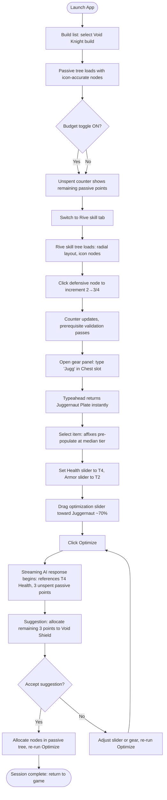
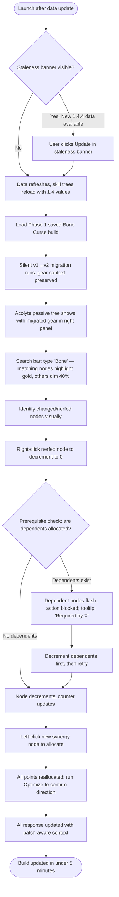
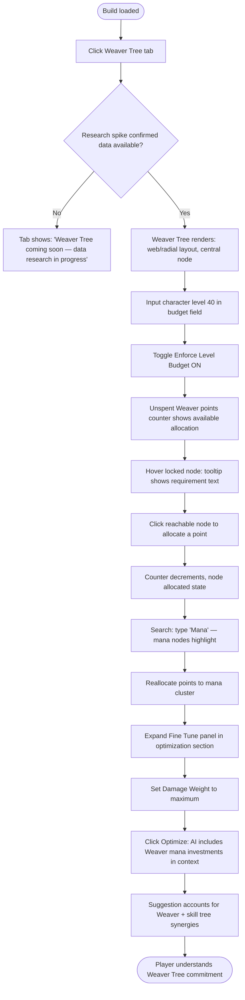
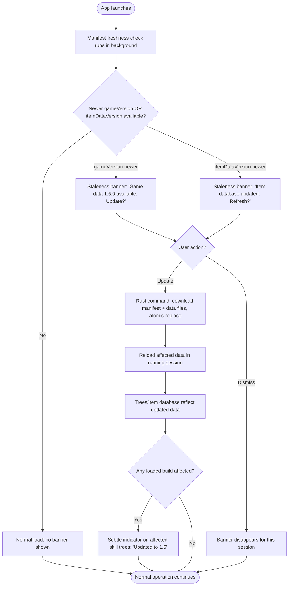

---
stepsCompleted:
  [
    'step-01-init',
    'step-02-discovery',
    'step-03-core-experience',
    'step-04-emotional-response',
    'step-05-inspiration',
    'step-06-design-system',
    'step-07-defining-experience',
    'step-08-visual-foundation',
    'step-09-design-directions',
    'step-10-user-journeys',
    'step-11-component-strategy',
    'step-12-ux-patterns',
    'step-13-responsive-accessibility',
    'step-14-complete',
  ]
inputDocuments:
  [
    '_bmad-output/project-intent-phase2.md',
    '_bmad-output/planning-artifacts/prd.md',
    '_bmad-output/project-context.md',
  ]
workflowType: 'bmad-create-ux-design'
classification:
  projectType: 'desktop_app'
  domain: 'gaming_companion'
  complexity: 'medium'
  projectContext: 'brownfield'
status: 'complete'
---

# UX Design Specification — LEBOv2 Phase 2

**Author:** Alec
**Date:** 2026-05-06
**Phase:** 2 of 3
**Status:** Complete — ready for Architecture and Epic Breakdown

---

## Executive Summary

### Project Vision

LEBOv2 Phase 2 transforms the fully-shipped Phase 1 MVP into a production-quality Last Epoch companion app. The UX goal is singular: give advanced players a tool that feels like a natural extension of how they already think about their builds — visually accurate, contextually smart, and frictionless to use. Players should be able to open any skill's tree, see the actual game icons they recognize, adjust their build with the same click interactions they use in-game, and receive AI suggestions that speak their language without any manual data entry friction.

Phase 2 closes the last gap with lastepochtools.com (icon-accurate skill tree rendering) while surpassing it with AI-driven optimization weighted to player archetype. No existing tool offers both. The UX must make this combination feel effortless — not like two tools bolted together.

### Target Users

**Primary: The Advanced Theory-Crafter**
- Knows Last Epoch deeply — understands passive trees, skill node prerequisites, affix tiers
- Currently uses lastepochtools.com for visual reference and manually calculates optimization
- Frustrated that no single tool lets them see their build visually AND get intelligent suggestions
- Technical comfort: high — tolerates complex interfaces but values efficiency over discoverability
- Context of use: seated at desktop, planning sessions between play sessions, often alt-tabbing from the game

**Secondary: The Returning Player**
- Takes breaks between patches; returns to find their build partially invalidated
- Has Phase 1 saves to migrate; must not lose any existing work
- Needs to quickly assess what changed in their build, update node allocations, and re-optimize
- Values speed of iteration over comprehensive exploration

**Out of scope (Phase 2):** Casual players, new players, streamers. This is the theorycrafting instrument, not an onboarding tool.

### Key Design Challenges

**Challenge 1: PixiJS Canvas + React UI Coexistence**
The skill trees render in a PixiJS WebGL canvas that is props-only and has no direct access to React state. All interaction on the canvas (node clicks) must flow back through React handlers. The visual language of hexagonal nodes, edges, and color states must be consistent with the surrounding React UI — but these two rendering contexts are architecturally separate. UX decisions must respect this boundary: canvas-rendered elements cannot use CSS design tokens; they use the equivalent hex values passed as props.

**Challenge 2: Novel Interaction on a Familiar Pattern**
Left-click to increment, right-click to decrement for multi-point nodes is a PoB-style interaction that the target audience already understands from Path of Building. However, it is non-standard for web/desktop applications. The design must make this interaction immediately discoverable through visual affordance (the `current/max` counter and the cursor state) without requiring a tutorial.

**Challenge 3: The Glass Cannon ↔ Juggernaut Slider as Primary UX Innovation**
This is the feature with no direct prior art in Last Epoch tooling. The slider must communicate a continuous spectrum of optimization intent in a single glance. The labeled endpoints ("Juggernaut" and "Glass Cannon") must immediately evoke the correct mental model — players use these exact archetypes when describing their builds. The Fine Tune expansion must feel like a natural power-user depth layer, not a different mode.

**Challenge 4: Gear Input Upgrade Without Disruption**
The item database typeahead replaces a free-text field that Phase 1 users already know. The transition must feel like an upgrade, not a replacement — the free-text fallback must be visible and easy to reach so users never feel forced into the structured path.

### Design Opportunities

**Opportunity 1: Icon Recognition as Instant Trust Signal**
When a player opens their Void Knight's Rive skill tree in Phase 2 and immediately sees the exact icons they recognize from in-game, the trust signal is instant and profound. This is the moment that differentiates Phase 2 from every other tool. Design must ensure icons load before any interaction is expected — they cannot pop in after a delay.

**Opportunity 2: AI Suggestions in Archetype Language**
Phase 1 AI suggestions use optimization vocabulary. Phase 2 can use archetype vocabulary — "your gear already provides max fire res, so the fire scaling node is redundant for a Juggernaut build." This is a qualitative shift in how the AI communicates. The slider position should visibly influence the language and framing of suggestions.

**Opportunity 3: Structured Gear as Silent Enabler**
The tier sliders for affixes look like a minor UI feature but represent a major improvement in AI context quality. The UX should surface this benefit subtly — when a suggestion references a specific affix tier the player set, the connection between their precise input and the specific output becomes clear without explanation.

---

## Core User Experience

### Defining Experience

The core experience of LEBOv2 Phase 2 is: **"See your exact build. Tune your intent. Get a specific suggestion."**

Three sequential beats, each with a distinct interaction:
1. **See** — Open a skill tree and recognize the actual game icons in the hexagonal nodes. This is the passive confirmation that the tool understands your game.
2. **Tune** — Drag the Glass Cannon ↔ Juggernaut slider to express what kind of character you want to play. This is the active declaration of intent.
3. **Get** — Click Optimize and receive an AI suggestion that references your actual node allocations, your actual gear affixes, and your declared intent. This is the payoff.

The entire session loop takes 2–5 minutes. Players open the app, adjust their build, rerun optimization, and return to the game. The UX must support this rapid iteration cycle with zero friction.

### Platform Strategy

- **Platform:** Tauri 2.x desktop application (Windows 10/11 + macOS 12+)
- **Input paradigm:** Mouse-primary with full keyboard support for all non-canvas controls
- **Canvas interaction:** Left-click (increment), right-click (decrement) on PixiJS canvas nodes — mouse required for tree interaction
- **Panel layout:** Fixed three-panel layout (Left 260px | Center flex-grow | Right 320px) with independently collapsible side panels to 48px icon rails
- **Window behavior:** Single window, no modal dialogs for primary workflows
- **Offline capability:** All data local; app functions fully offline after initial data load

### Effortless Interactions

**Absolutely zero effort required:**
- Icon loading on first launch (auto-detects Steam, extracts silently, falls back to CDN — user never touches this)
- Phase 1 build migration (automatic on load, no prompt, no data loss)
- Data freshness detection (app detects stale data on launch, shows passive banner — no user polling required)

**Minimal effort required (one action):**
- Switching between active skill tabs
- Opening the skill picker for a slot
- Toggling level budget enforcement
- Expanding the Fine Tune panel
- Resetting a tree

**Intentionally requires thought:**
- Setting affix tiers (per-affix precision is the point — fast defaults exist but precision is rewarded)
- Positioning the optimization slider (this is a meaningful declaration, not a throwaway click)

### Critical Success Moments

1. **First icon render** — The first time a player opens a skill tree in Phase 2 and sees the real game icons, they know this is different. This must happen before any interaction is prompted. Icon loading must be pre-empted, not lazy.

2. **First gear-aware suggestion** — When the AI response references a specific affix ("your T4 Health roll is strong enough that…"), the player understands the tier slider they set is being used. This moment validates the structured input workflow.

3. **First prerequisite validation** — When a player tries to click a locked node and the visual state clearly prevents it without confusion (cursor change, visual lock indicator, tooltip explaining why), they understand the tree's rules without needing a guide.

4. **Budget counter reaching zero** — When the unspent counter hits 0 with the budget toggle ON, the player has a complete, level-valid build. The counter serves as a real-time completion signal.

### Experience Principles

1. **The game's visual language is the UX language.** Icons, hexagonal node shapes, and mastery colors are not decorative — they are the vocabulary players already speak. Every visual decision should reinforce familiarity, not introduce novelty.

2. **Precision is opt-in.** The default state (no tier sliders set, budget toggle OFF, master slider centered) is usable and useful. Every layer of precision (tier setting, level enforcement, Fine Tune sub-sliders) is an opt-in upgrade, never a requirement.

3. **No blocking feedback.** Data freshness warnings, icon source status, item database version notices — all are non-blocking banners that can be dismissed or deferred. The app never puts a modal between the user and their build.

4. **The canvas is sacred space.** The PixiJS skill tree canvas occupies center stage. The left and right panels support the canvas — they never compete with it visually. When both panels are collapsed, the canvas is the full viewport.

5. **Fail visibly at the edge, invisibly in the middle.** If icon extraction fails, the CDN fallback happens silently. If the CDN fails, placeholder icons appear silently. Only if placeholders themselves would fail is the user notified — and then only with a subtle indicator, never a blocking error.

---

## Desired Emotional Response

### Primary Emotional Goals

**Empowered and precise.** After using Phase 2, a player should feel they understand their build at a level of detail they couldn't access before. Not just "I have a Void Knight with these nodes" — but "I have a Void Knight with 3/4 in Void Shield and my T4 Health chest is already covering the defensive floor, so the last 3 passive points go into the offensive cluster." This granularity, surfaced effortlessly, is the primary emotional payoff.

**Expert-adjacent.** The tool should make players feel like a more knowledgeable version of themselves — not like they're outsourcing thinking to an AI, but like they have a knowledgeable colleague who confirms and sharpens what they already suspected. Suggestions should feel validating, not corrective.

### Emotional Journey Mapping

| Stage | Desired Emotion | Design Response |
|-------|----------------|-----------------|
| App launch | Anticipation (loading my build) | Fast cold start; build list visible immediately; no loading spinners on known data |
| Tree view opens | Recognition (those are my skill icons) | Icons pre-loaded before tree is interactive; familiar hexagonal layout matches game |
| Adjusting nodes | Competence (I know what I'm doing) | Immediate visual feedback on click; `current/max` always visible; prerequisites enforced clearly |
| Setting gear affixes | Investment (I'm putting real data in) | Tier slider defaults to median; selecting feels meaningful; affix name matches in-game display |
| Dragging the slider | Declaration (this is what I want) | Gradient track reinforces the spectrum; labels are instantly legible; Fine Tune expansion feels like going deeper, not switching modes |
| Waiting for optimization | Confident anticipation | Streaming output starts fast; partial suggestions are readable, not a loading spinner |
| Reading a suggestion | Insight (it knows my gear) | References specific affix values and node names the player recognizes; before/after score visible |
| Build saved | Satisfaction (I'm ready to play) | Quiet confirmation; no fanfare; the work speaks for itself |

### Micro-Emotions

**Confidence over anxiety:** The unspent points counter and `current/max` node display always tell the player exactly where they stand. There is never ambiguity about whether they've over-allocated. Anxiety about "did I do this right?" is eliminated by the counter.

**Discovery over confusion:** When a player hovers a locked node and reads "Requires: Void Shield at 2+" in the tooltip, the prerequisite system is self-explanatory. No tutorial needed. The lock icon with the tooltip is the discoverable affordance.

**Investment over form-filling:** The item database flow must feel like building a profile of your gear, not filling out a form. The typeahead search that instantly surfaces matching items rewards typing. The tier slider is a physical gesture, not a text input.

**Control over dependence:** The Fine Tune panel exists to signal that the master slider is a simplification, not a limitation. Power users who expand Fine Tune are asserting control. The panel must feel like capability revealed, not complexity added.

### Design Implications

- **Empowerment → Data always visible.** Unspent counter, `current/max` on every node, character level and budget always readable. Data density is appropriate for this audience — never hide information that the player wants to see.
- **Expert-adjacent → AI language matters.** The optimization request should include slider position as a named archetype context. When Fine Tune is expanded, the three sub-weights should be included as named values. The AI's output should reflect the player's framing.
- **No anxiety → Undo always available.** The Phase 1 undo stack (10 snapshots, node allocations only) must remain fully functional. Right-clicking to decrement is the primary correction mechanism; Ctrl+Z as a secondary.
- **Investment without form-filling → Smart defaults.** When an item is selected from the database, affixes pre-populate at median tier. Only when the player wants to refine do they touch the tier sliders. The default state is already useful.

### Emotional Design Principles

1. **Information is comfort.** This audience is not overwhelmed by data — they seek it. Show all relevant data by default. Trust the user.
2. **First impressions are visual.** The emotional impact of icon-accurate nodes is immediate and visceral. Invest in ensuring they render before any interaction is expected.
3. **Suggestions as collaboration, not prescription.** The AI is a knowledgeable teammate, not an authority. Before/after scoring frames suggestions as proposals the player evaluates, not directives they follow.

---

## UX Pattern Analysis & Inspiration

### Inspiring Products Analysis

**lastepochtools.com — Visual Reference**
What it does well: icon-accurate hexagonal skill trees, organized skill picker with mastery-gate badges, familiar visual language that matches the game. Players trust it because it looks like Last Epoch.
What it lacks: no AI layer, no optimization, no affix-tier awareness.
Key UX lesson: Match the game's visual language exactly. Players orient to known icons, not generic shapes.

**Path of Building (PoB) — Interaction Reference**
What it does well: PoB-style left-click/right-click node allocation is the established interaction pattern for ARPG theory-crafting; players in this audience know it from Path of Exile. Deep data access creates expert-user investment. The `current/max` display on nodes is universally understood.
What it lacks: No visual fidelity (generic shapes, not game icons). No AI.
Key UX lesson: The click/right-click interaction requires no explanation for this audience — implement it exactly, don't soften it with hover-menu alternatives.

**Cursor IDE (slider as primary AI control)**
What it does well: A single slider or mode selector as the primary AI intent control — simple surface, sophisticated behavior underneath. Users express intent through a continuous spectrum, not by writing prompts.
Key UX lesson: The Glass Cannon ↔ Juggernaut slider directly borrows this pattern. The slider is the prompt.

**Headless UI + Tailwind (existing tech stack)**
What it does well: Combobox pattern for typeahead search is well-tested and accessible. Disclosure pattern for Fine Tune expansion is the right primitive for expandable control panels.
Key UX lesson: Use Headless UI Combobox for item search (ARIA combobox role, accessible keyboard nav), Disclosure for Fine Tune.

### Transferable UX Patterns

**Navigation Patterns:**
- Tab-per-active-skill remains the right navigation model (established in Phase 1, familiar to users)
- Skill picker opens in a dropdown/flyout anchored to the active tab, not a separate page

**Interaction Patterns:**
- Left-click/right-click node allocation (PoB pattern, already understood by this audience)
- Typeahead-first for all database lookups (item search, affix addition)
- Slider as primary AI intent control (Cursor IDE pattern adapted for ARPG archetype language)

**Visual Patterns:**
- Hexagonal node shapes with icon + `current/max` overlay (lastepochtools.com pattern)
- Mastery-gate badge overlay on skill picker grid (lastepochtools.com pattern)
- Gold accent on selected/highlighted state (existing Phase 1 token `--color-accent-gold`)

**Feedback Patterns:**
- Search highlight: matching nodes → gold highlight; non-matching → 40% opacity dim
- Node lock: desaturated icon + lock badge + tooltip on hover
- Unspent counter: always visible above tree; color-shifts when at zero (satisfied) vs. positive (points remaining)

### Anti-Patterns to Avoid

**Modal-blocking for non-critical information.** Data freshness notices, icon source status, item database version — none of these are blocking. A modal that interrupts tree interaction to ask "New data available — update now?" would be the wrong pattern. Use a passive staleness banner.

**Progressive form for gear input.** A step-by-step "Add Item Wizard" flow would be patronizing for this audience. They want to type, see results, click, and adjust — all in one flow, in one place.

**Confirmation dialogs for reversible actions.** RESET tree, remove a gear item, decrement a node — all are reversible (undo stack) or easily re-done. No confirmation dialogs. The action should happen immediately with visual feedback.

**Hiding the free-text fallback.** The item database typeahead is an upgrade over free-text, but the free-text path must remain visible and accessible. Never make the user feel trapped in the structured flow.

**Using a dropdown for the optimization preset selection.** The Phase 1 4-button preset was already borderline; a dropdown would be worse. The master slider replaces this entirely — no dropdown, no select element, no list of presets.

### Design Inspiration Strategy

**Adopt directly:**
- lastepochtools.com hexagonal node layout and skill picker grid organization
- PoB left-click/right-click node interaction
- Headless UI Combobox for all typeahead searches
- Headless UI Disclosure for Fine Tune sub-slider expansion

**Adapt for LEBOv2:**
- Cursor IDE's AI intent slider → adapted as archetype-labeled spectrum with gradient track (red right = Glass Cannon, blue left = Juggernaut)
- Staleness notification banner from app update patterns → adapted for game data + item database versioning with two separate version indicators

**Avoid entirely:**
- Wizard/step-by-step flows for gear input
- Modal dialogs for informational notices
- Dropdown/select elements where a slider or toggle communicates intent better

---

## Design System Foundation

### Design System Choice

**Custom dark ARPG theme extending the Phase 1 system.**
This is a brownfield project. The Phase 1 design system — defined entirely through CSS variables in Tailwind v4 — is the foundation. Phase 2 extends it; it does not replace it.

The existing Phase 1 token set covers the full visual vocabulary:
- Background layers: `--color-bg-base`, `--color-bg-surface`, `--color-bg-elevated`, `--color-bg-hover`
- Accent system: `--color-accent-gold`, `--color-accent-gold-soft`, `--color-accent-gold-dim`
- Data colors: `--color-data-damage`, `--color-data-surv`, `--color-data-speed`
- Node states (PixiJS hex equivalents): `--color-node-allocated`, `--color-node-available`, `--color-node-locked`, `--color-node-suggested`
- Text hierarchy: `--color-text-primary`, `--color-text-secondary`, `--color-text-muted`

Phase 2 adds three new semantic tokens for the optimization slider spectrum (see Visual Design Foundation).

**UI primitives:** Headless UI 2.x for accessible interactive components (Combobox, Disclosure, Switch, Listbox). These are unstyled primitives that receive Tailwind utility classes — no style conflicts with the custom dark theme.

### Rationale for Selection

1. **Brownfield continuity.** Introducing a third-party design system (MUI, Chakra) would conflict with the established CSS variable system and require significant migration work. The existing Phase 1 UI is complete and functional.
2. **Solo developer velocity.** Extending known tokens is faster than learning a new system's override patterns.
3. **Canvas/React boundary.** PixiJS uses hex colors directly. Maintaining a single token set (CSS variables → hex) in one place is simpler than mapping to a third-party system's design tokens.
4. **Control over dark ARPG aesthetic.** Off-the-shelf systems (Material, Ant Design) optimize for light mode, data-dense enterprise UIs. The dark, gold-accented aesthetic requires full control.

### Implementation Approach

- All new Phase 2 components use existing CSS variable tokens via Tailwind utility classes (`text-[var(--color-text-primary)]`, `bg-[var(--color-bg-surface)]`)
- New tokens added directly to the global stylesheet as CSS variables
- Headless UI components styled with Tailwind classes, following established patterns from Phase 1 components
- PixiJS node colors stay in sync with CSS tokens by co-locating the hex constants next to the CSS variable definitions in the global stylesheet as a comment

### Customization Strategy

**New tokens required for Phase 2:**
- `--color-slider-glass-cannon` — right pole of the optimization slider gradient (high-damage archetype color)
- `--color-slider-juggernaut` — left pole of the optimization slider gradient (tank archetype color)
- `--color-tier-pip-active` — active tier pip in the affix tier slider
- `--color-tier-pip-inactive` — inactive tier pip in the affix tier slider
- `--color-badge-mastery-gate` — the point-threshold badge overlay on skill picker nodes

**Token extension rule:** All new tokens must fit within the existing naming convention (`--color-{category}-{role}`) and must be documented alongside their PixiJS hex equivalents in the global stylesheet comment block.

---

## 2. Core User Experience

### 2.1 Defining Experience

**"Allocate your build → Declare your archetype → Get a specific, level-aware suggestion."**

This is the defining three-beat interaction of Phase 2. Every design decision in Phase 2 should either enable one of these beats or get out of their way.

Unlike Phase 1 where the defining experience was "paste gear text → press optimize → get a generic suggestion," Phase 2 makes each input precise and the output specific. The skill tree is no longer a toggle display — it's an interactive allocation tool where every click has meaning. The gear is no longer a text blob — it's a structured record of what you actually have. The optimization intent is no longer a four-button guess — it's a continuous archetype declaration.

The tool is equivalent to asking a knowledgeable Last Epoch expert: "I have this exact build, with this exact gear, and I want to be more of a Juggernaut — what single change should I make?" Phase 2 makes that question answerable with precision.

### 2.2 User Mental Model

**How players currently think:** Players think in archetypes and vibe categories. "I want to be unkillable" maps to "Juggernaut." "I want to delete the screen" maps to "Glass Cannon." They do not natively think in optimization weight percentages.

**What they bring to skill trees:** Players have a strong visual memory of skill trees from the game. They recognize icons immediately and navigate by spatial memory ("the defensive cluster is at the bottom-left of the Void Knight tree"). Any deviation from this visual memory creates friction.

**Where confusion arises in competing tools:** lastepochtools.com's tree is read-only; players annotate it mentally. Path of Building requires file import. Neither tool explains *why* a particular allocation is recommended — they show what to do, not why. Phase 2's AI explanations fill this gap.

**Mental model of the gear input:** Players think of their gear as "my chest is a Juggernaut Plate with T4 Health and T2 Armor." The typeahead + pre-populated affixes + tier sliders models this mental representation directly: name → known affixes → adjust to your actual rolls.

### 2.3 Success Criteria

**For the skill tree interaction:**
- Left-click on any allocatable node immediately increments the counter and updates the visual state with no perceptible lag
- Right-clicking a node whose removal would break prerequisites highlights the dependent nodes and prevents the action with a tooltip — the player understands why without confusion
- The unspent counter updates after every click with no delay and never shows an incorrect value

**For the gear input:**
- Typing 3+ characters into a gear slot shows relevant results within 50ms
- Selecting an item from the typeahead and seeing the pre-populated affixes feels like the tool already knows your item
- Moving a tier slider to match your actual roll feels like setting a fact, not filling a form

**For the optimization slider:**
- Dragging the slider to either extreme takes under 2 seconds and feels physically satisfying
- The gradient track communicates the spectrum meaning without reading the endpoint labels
- Clicking Optimize after moving the slider and receiving a suggestion that references the slider's position validates the interaction

### 2.4 Novel UX Patterns

**Novel for Last Epoch tooling:**
- Glass Cannon ↔ Juggernaut continuous spectrum slider (no prior art in LE tools)
- Icon-accurate PixiJS node rendering (lastepochtools.com does it in DOM, not PixiJS canvas)
- Fine Tune sub-slider expansion (Cursor-style AI intent depth pattern, new to this domain)

**Established patterns used:**
- Typeahead item search (standard combobox pattern)
- Left-click/right-click node allocation (PoB pattern, well-known to target audience)
- Mastery-gate badges on skill picker grid (directly from lastepochtools.com)
- Tab-per-active-skill navigation (Phase 1 established, user-familiar)

**Teaching the novel patterns:**
- Slider: endpoint labels ("Juggernaut" left, "Glass Cannon" right) + gradient track + tooltip on hover showing current weight split — no explicit instruction needed
- Fine Tune: `▼ Fine Tune` disclosure trigger with visible chevron — standard expansion pattern
- Multi-point nodes: `current/max` counter always visible; cursor changes to resize cursor on hover over allocatable node — affordance is inherent

### 2.5 Experience Mechanics

**Skill Tree Node Allocation:**
1. **Initiation:** Mouse hover over an allocatable node changes cursor to `pointer` and shows node name + current stats in a floating tooltip
2. **Interaction:** Left-click increments; right-click decrements. Counter updates immediately. Node redraws with updated state.
3. **Feedback:** `current/max` counter in node updates; unspent counter above tree decrements; if max reached, node visually saturates/locks further increment; if prerequisite violated on decrement, action is blocked and dependent nodes briefly flash
4. **Completion:** Unspent counter reaches 0 (budget mode) or player manually stops allocating

**Glass Cannon ↔ Juggernaut Slider:**
1. **Initiation:** Slider is always visible in the optimization panel. Default center position. Thumb shows current position.
2. **Interaction:** Click-drag thumb or click track to jump. Keyboard: arrow keys move in 5% increments. Slider emits value 0–100 (0 = full Juggernaut, 100 = full Glass Cannon, 50 = balanced).
3. **Feedback:** Gradient track shows color shift as slider moves. Tooltip on thumb shows current weight split (e.g., "Survivability 70% / Damage 30%"). Fine Tune panel (if expanded) sub-sliders respond synchronously.
4. **Completion:** Slider position is captured in optimization request on next Optimize click.

**Item Typeahead Search:**
1. **Initiation:** Click gear slot to focus the typeahead input. Placeholder: "Search items…"
2. **Interaction:** Type item name; results appear within 50ms. Select with Enter or click. ESC cancels.
3. **Feedback:** Selected item card replaces the input, showing item name, base type, and pre-populated affixes at median tier. Affix tier sliders appear immediately.
4. **Completion:** Gear slot is populated. Player adjusts tier sliders as needed or moves to next slot.

---

## Visual Design Foundation

### Color System

The Phase 1 custom dark theme is the foundation. Phase 2 extends it with five new tokens.

**Existing token palette (retained exactly from Phase 1):**

| Token | Role | Approximate Value |
|-------|------|------------------|
| `--color-bg-base` | Page/app background | Deep near-black (`#0d0d0f`) |
| `--color-bg-surface` | Panel/card backgrounds | Dark gray (`#141416`) |
| `--color-bg-elevated` | Dropdowns, tooltips, modals | Slightly lighter (`#1e1e22`) |
| `--color-bg-hover` | Interactive element hover state | Subtle highlight (`#252529`) |
| `--color-accent-gold` | Primary accent: selected states, highlights, CTAs | Gold (`#c8a84b`) |
| `--color-accent-gold-soft` | Secondary accent: icons, borders | Muted gold (`#8a7535`) |
| `--color-accent-gold-dim` | Subtle accent: dividers, inactive tabs | Dim gold (`#4a3f1e`) |
| `--color-data-damage` | Damage-related data indicators | Ember red-orange |
| `--color-data-surv` | Survivability-related data indicators | Cool blue-teal |
| `--color-data-speed` | Speed-related data indicators | Yellow-green |
| `--color-node-allocated` | Allocated skill node fill | Bright gold (`#c8a84b`) |
| `--color-node-available` | Available (allocatable) node fill | Muted gray-blue |
| `--color-node-locked` | Locked node fill | Dark gray with reduced opacity |
| `--color-node-suggested` | AI-suggested node highlight | Soft amber glow |
| `--color-text-primary` | Primary text | Near-white (`#e8e8ea`) |
| `--color-text-secondary` | Secondary/label text | Light gray (`#9494a0`) |
| `--color-text-muted` | Muted/disabled text | Dark gray (`#5a5a68`) |

**Phase 2 new tokens:**

| Token | Role | Value Direction |
|-------|------|----------------|
| `--color-slider-glass-cannon` | Right pole of optimization slider gradient | High-saturation crimson-red (represents aggression, damage) |
| `--color-slider-juggernaut` | Left pole of optimization slider gradient | Deep steel-blue (represents defense, endurance) |
| `--color-tier-pip-active` | Filled tier pip on affix tier slider | Matches `--color-accent-gold` |
| `--color-tier-pip-inactive` | Unfilled tier pip on affix tier slider | Matches `--color-bg-elevated` with border |
| `--color-badge-mastery-gate` | Mastery point requirement badge background | Dark overlay with muted gold border |

**Accessibility:** All text colors meet WCAG AA 4.5:1 contrast ratio against their paired background tokens. The focus ring is always `2px solid var(--color-accent-gold)` — never `outline: none` without this replacement.

### Typography System

**Inherited from Phase 1 (extend, not change):**
- System font stack for all body and UI text: `-apple-system, BlinkMacSystemFont, 'Segoe UI', sans-serif`
- Monospace for numeric values (node counters, tier values, score deltas): `'JetBrains Mono', 'Fira Code', monospace`
- No web fonts (desktop app, system fonts are optimal for performance and rendering fidelity)

**Type scale for Phase 2 additions:**

| Element | Size | Weight | Token |
|---------|------|--------|-------|
| Skill picker section header (class name) | 11px | 600 | `--color-text-secondary`, uppercase, 0.08em letter-spacing |
| Skill node tooltip header | 14px | 600 | `--color-text-primary` |
| `current/max` counter in nodes | 10px | 700 | Rendered directly in PixiJS canvas |
| Item name in gear slot | 14px | 600 | `--color-text-primary` |
| Affix name label | 13px | 400 | `--color-text-secondary` |
| Tier value in tier slider | 11px | 600 | `--color-accent-gold` |
| Slider pole labels (Juggernaut / Glass Cannon) | 11px | 700 | `--color-text-secondary`, uppercase |
| Unspent counter value | 18px | 700 | `--color-accent-gold` when > 0; `--color-text-secondary` when = 0 |
| Fine Tune sub-slider label | 12px | 400 | `--color-text-muted` |

**Numerical display principle:** All numbers that represent in-game values (tier numbers, point counts, score deltas) use the monospace font. This ensures columns align and values are immediately readable.

### Spacing & Layout Foundation

**Base unit:** 4px. All spacing is multiples of this unit.

**Panel layout (inherited from Phase 1):**
- Left panel: 260px default, 48px collapsed (icon rail)
- Center: `flex-grow`, minimum usable width 480px
- Right panel: 320px default, 48px collapsed (icon rail)
- Panels collapse independently with 200ms ease-out transition (reduced motion: instant)

**Phase 2 layout considerations:**

The right panel (320px) houses the gear input in Phase 2. The current Phase 1 right panel fits the optimization controls and suggestions. With Phase 2 adding item slots + tier sliders, the right panel content becomes significantly taller. Design strategy:

- Gear input section and optimization section are **separately scrollable regions within the right panel**, not stacked in a single scroll container
- Gear slot items use a compact card representation: item name + 2-line affix summary. Full tier sliders expand inline on click (Disclosure pattern)
- The optimization section (slider + Fine Tune + Optimize button) is pinned to the bottom of the right panel and never scrolls off screen

**Compact spacing rules for the right panel:**
- Gear slot card: 8px vertical padding, 12px horizontal padding
- Tier slider track height: 4px, thumb: 12px × 12px
- Tier pips: 8px × 8px with 4px gap between pips
- Fine Tune sub-slider row: 32px height including label

**Central canvas area:**
- Skill tree tab bar: 40px height
- Search bar row: 36px height, positioned above tree (same row as RESET button and unspent counter)
- Canvas fills remaining height minus tab bar and search row

### Accessibility Considerations

**Focus management:**
- Focus ring: `2px solid var(--color-accent-gold)` + `2px solid transparent` outline offset to prevent background bleed. This applies to ALL interactive elements outside the PixiJS canvas.
- Tab order follows visual reading order (left panel → center (tab bar) → right panel)
- Skill tree canvas is intentionally excluded from tab order — mouse interaction is required for node allocation. This is acceptable for the target audience and disclosed in the app.

**ARIA requirements for Phase 2 additions:**
- Item search: `role="combobox"`, `aria-expanded`, `aria-activedescendant`, `aria-autocomplete="list"`
- Optimization slider: `role="slider"`, `aria-valuemin="0"`, `aria-valuemax="100"`, `aria-valuenow`, `aria-label="Optimization intent: Juggernaut to Glass Cannon"`
- Fine Tune section: `aria-controls` pointing to sub-slider container; `aria-expanded` on trigger
- Tier sliders: `role="slider"`, `aria-valuemin="1"`, `aria-valuemax="{tierCount}"`, `aria-label="{affixName} tier"`
- Staleness banner: `role="status"`, `aria-live="polite"`
- Unspent counter: `aria-live="polite"` with `aria-label="Unspent points: {count}"`

**Reduced motion:**
- All panel collapse/expand transitions: gated by `useReducedMotion()` hook
- Optimization slider thumb drag: no animation on position
- Skill picker grid open transition: instant when `prefers-reduced-motion: reduce`
- PixiJS canvas: `drawSuggested` already skips the glow ring animation when `reducedMotion = true` (Phase 1 rule, unchanged)

---

## Design Direction Decision

### Design Directions Explored

Given LEBOv2 Phase 2 is a brownfield extension, visual direction exploration focused on how to extend the established dark-gold aesthetic to accommodate Phase 2's new surfaces rather than considering wholesale redesign. Five directional approaches were considered:

**Direction 1 — "Focused Instrument" (Selected)**
Extend Phase 1's dark-gold vocabulary with absolute fidelity. New Phase 2 surfaces (item slots, tier sliders, optimization slider) adopt the same visual language as Phase 1 — dark surfaces, gold accent, minimal decoration. The Glass Cannon ↔ Juggernaut slider gets a gradient track as its one visual innovation. Icons and game assets are the heroes; UI chrome is invisible infrastructure.

**Direction 2 — "Expanded Panels"**
Wider right panel (400px) to accommodate full gear input with larger tier controls. Rejected: 320px is sufficient for compact card layout with inline expansion; 400px steals too much from center canvas at 1080p.

**Direction 3 — "Floating Gear Overlay"**
Item database input floats as a overlay above the build when active. Rejected: disrupts the persistent awareness of all 14 gear slots; breaks the mental model of "I can see my full gear at a glance."

**Direction 4 — "Color-Coded Pillars"**
Each pillar (Skill Trees, Item Database, Optimization) gets a distinct accent color. Rejected: three competing accents fragments the visual vocabulary; the gold accent is already the identity signal.

**Direction 5 — "Progressive Reveal"**
Default to a minimal view (skill trees only); reveal item database and optimization sections as the player progresses through their build. Rejected: this audience knows they want all three pillars accessible; progressive reveal adds friction, not clarity.

### Chosen Direction

**Direction 1: "Focused Instrument"**

The Phase 2 UI is an extension of Phase 1, not a rethink. The dark-gold vocabulary, three-panel layout, and canvas-centric design are confirmed correct by Phase 1 user behavior. Phase 2 adds capability to existing surfaces without visual disruption.

**Key extension decisions:**
- Right panel splits into two independently scrollable sections: **Gear Context** (upper, ~55% of height) and **Optimization** (lower, ~45% of height, pinned with no scroll-off)
- The Glass Cannon ↔ Juggernaut slider uses a gradient track from `--color-slider-juggernaut` (left) to `--color-slider-glass-cannon` (right) as the single strongest visual statement of Phase 2
- Gear slot cards are compact dark cards with the item name in primary text and a 2-line affix summary in secondary text — identical visual treatment to how build metadata is displayed in Phase 1
- The skill picker grid uses the same hexagonal frame style as the PixiJS canvas nodes, maintaining visual continuity between the picker (React DOM) and the tree (PixiJS canvas)
- Mastery-gate badge overlays (point thresholds: 5, 10, 15, 20, 25, 35) use `--color-badge-mastery-gate` — a dark pill with muted gold border that overlays the bottom edge of the skill icon without obscuring it

### Design Rationale

1. **Brownfield continuity.** Players who have used Phase 1 should feel at home immediately. The learning curve for Phase 2 is the new capabilities, not a new visual language.
2. **Canvas is always the hero.** No Phase 2 change should reduce the visual prominence of the PixiJS skill tree canvas. The design direction explicitly reserves the center stage for the canvas.
3. **One visual innovation per release.** The gradient optimization slider is Phase 2's visual innovation. Every other new element is invisible infrastructure. One bold, purposeful addition is more powerful than many small ones.
4. **Glass Cannon / Juggernaut gradient communicates instantly.** The gradient from steel-blue to crimson-red maps to intuitive mental models (cool = defensive, hot = aggressive) without reading any label. The labels confirm what the gradient already communicates.

### Implementation Approach

- All new React components use existing CSS token classes; no raw color values in component code
- Skill picker grid is a React DOM component (not PixiJS) using the same hex/clip-path hexagonal shape as the canvas nodes for visual continuity
- The glass cannon ↔ juggernaut gradient track is a CSS linear-gradient applied to a custom range input styled element (`appearance: none` + CSS track pseudo-element)
- HTML design direction mockups: see `_bmad-output/planning-artifacts/ux-design-directions.html`

---

## User Journey Flows

### Journey 1 — The Theory-Crafter: Optimizing a Void Knight Build

**Flow: Gear-Aware Optimization**

```mermaid
flowchart TD
    A([Launch App]) --> B[Build list: select Void Knight build]
    B --> C[Passive tree loads with icon-accurate nodes]
    C --> D{Budget toggle ON?}
    D -- Yes --> E[Unspent counter shows remaining passive points]
    D -- No --> E
    E --> F[Switch to Rive skill tab]
    F --> G[Rive skill tree loads: radial layout, icon nodes]
    G --> H[Click defensive node to increment 2→3/4]
    H --> I[Counter updates, prerequisite validation passes]
    I --> J[Open gear panel: type 'Jugg' in Chest slot]
    J --> K[Typeahead returns Juggernaut Plate instantly]
    K --> L[Select item: affixes pre-populate at median tier]
    L --> M[Set Health slider to T4, Armor slider to T2]
    M --> N[Drag optimization slider toward Juggernaut ~70%]
    N --> O[Click Optimize]
    O --> P[Streaming AI response begins: references T4 Health, 3 unspent passive points]
    P --> Q[Suggestion: allocate remaining 3 points to Void Shield]
    Q --> R{Accept suggestion?}
    R -- Yes --> S[Allocate nodes in passive tree, re-run Optimize]
    R -- No --> T[Adjust slider or gear, re-run Optimize]
    S --> U([Session complete: return to game])
    T --> O
```

**Journey 1 UX Notes:**
- Passive tree and skill tree must both be visible and navigable without closing or switching modes — tab-per-skill for active trees, a separate Passive tab in the same tab bar
- The right panel shows both gear slots AND optimization controls; user should never need to scroll between them for the primary flow

---

### Journey 2 — The Returning Player: Post-Patch Build Update

**Flow: Migration + Incremental Update**

```mermaid
flowchart TD
    A([Launch after data update]) --> B{Staleness banner visible?}
    B -- Yes: New 1.4.4 data available --> C[User clicks Update in staleness banner]
    B -- No --> D
    C --> D[Data refreshes, skill trees reload with 1.4 values]
    D --> E[Load Phase 1 saved Bone Curse build]
    E --> F[Silent v1→v2 migration runs: gear context preserved]
    F --> G[Acolyte passive tree shows with migrated gear in right panel]
    G --> H[Search bar: type 'Bone' — matching nodes highlight gold, others dim 40%]
    H --> I[Identify changed/nerfed nodes visually]
    I --> J[Right-click nerfed node to decrement to 0]
    J --> K{Prerequisite check: are dependents allocated?}
    K -- Dependents exist --> L[Dependent nodes flash; action blocked; tooltip: 'Required by X']
    K -- No dependents --> M[Node decrements, counter updates]
    L --> N[Decrement dependents first, then retry]
    N --> M
    M --> O[Left-click new synergy node to allocate]
    O --> P[All points reallocated: run Optimize to confirm direction]
    P --> Q[AI response updated with patch-aware context]
    Q --> R([Build updated in under 5 minutes])
```

**Journey 2 UX Notes:**
- Staleness banner is non-blocking: positioned below the tab bar at the top of the center panel, 32px height, with "Update" CTA and "Dismiss" link
- The v1→v2 migration is completely silent — no prompt, no loading indicator, no data loss message
- Search highlight is bi-directional: typing in the search bar highlights matching nodes; clearing the search restores all nodes immediately

---

### Journey 3 — The Weaver Tree Explorer

**Flow: First-Time Weaver Tree Exploration (contingent on research spike)**

```mermaid
flowchart TD
    A([Build loaded]) --> B[Click Weaver Tree tab]
    B --> C{Research spike confirmed data available?}
    C -- No --> D[Tab shows: 'Weaver Tree coming soon — data research in progress']
    C -- Yes --> E[Weaver Tree renders: web/radial layout, central node]
    E --> F[Input character level 40 in budget field]
    F --> G[Toggle Enforce Level Budget ON]
    G --> H[Unspent Weaver points counter shows available allocation]
    H --> I[Hover locked node: tooltip shows requirement text]
    I --> J[Click reachable node to allocate a point]
    J --> K[Counter decrements, node allocated state]
    K --> L[Search: type 'Mana' — mana nodes highlight]
    L --> M[Reallocate points to mana cluster]
    M --> N[Expand Fine Tune panel in optimization section]
    N --> O[Set Damage Weight to maximum]
    O --> P[Click Optimize: AI includes Weaver mana investments in context]
    P --> Q[Suggestion accounts for Weaver + skill tree synergies]
    Q --> R([Player understands Weaver Tree commitment])
```

---

### Journey 4 — The Data Update Scenario

**Flow: Background Data Freshness Check**

```mermaid
flowchart TD
    A([App launches]) --> B[Manifest freshness check runs in background]
    B --> C{Newer gameVersion OR itemDataVersion available?}
    C -- No --> D[Normal load: no banner shown]
    C -- gameVersion newer --> E[Staleness banner: 'Game data 1.5.0 available. Update?']
    C -- itemDataVersion newer --> F[Staleness banner: 'Item database updated. Refresh?']
    E --> G{User action?}
    F --> G
    G -- Update --> H[Rust command: download manifest + data files, atomic replace]
    G -- Dismiss --> I[Banner disappears for this session]
    H --> J[Reload affected data in running session]
    J --> K[Trees/item database reflect updated data]
    K --> L{Any loaded build affected?}
    L -- Yes --> M[Subtle indicator on affected skill trees: 'Updated to 1.5']
    L -- No --> N([Normal operation continues])
    M --> N
    D --> N
    I --> N
```

**Journey 4 UX Notes:**
- Game data and item data have separate staleness checks and separate banners if both are stale simultaneously
- The data update is atomic: if download fails mid-transfer, existing data is untouched
- The banner auto-dismisses after the update completes

---

### Journey Patterns

**Navigation Pattern — Tab-First, Panel-Secondary**
All tree navigation happens via the tab bar (passive tree tab + active skill slots 1–5 + Weaver Tree tab). Panel switches (expand/collapse left or right) are independent of tree navigation. A player can collapse the right panel while exploring trees.

**Feedback Pattern — Immediate Visual, Deferred Structural**
Node clicks produce immediate visual feedback (counter update, state change) before any state is persisted. Build saving is deferred to explicit Save or auto-save on tab close — never blocks interaction.

**Decision Pattern — Reversible First**
Every allocation decision is reversible (right-click to decrement, RESET to clear all, Ctrl+Z for undo). The UI communicates this reversibility: the RESET button is always visible; the undo stack (10 snapshots) is always available.

**Error Pattern — Inline, Non-Blocking**
Prerequisite validation errors: blocked node flashes briefly, tooltip explains. Gear search with no results: "No items found" inline in the dropdown, not a toast or dialog. Data update failure: silent retry on next launch, no error toast.

### Flow Optimization Principles

1. **Primary flow path requires zero configuration.** Open app → select build → interact with tree → optimize. No setup, no preferences, no onboarding. The tool works at first launch.

2. **Every secondary action is discoverable but not prominent.** The Fine Tune expansion trigger (`▼ Fine Tune`) is below the master slider — visible but smaller. The budget toggle is next to the level input — visible when relevant. Custom affix addition (`+` button) is on the item card — visible after item selection.

3. **Scrolling is the last resort.** The right panel content must fit in 900px viewport height without scrolling for the primary flow (4–5 gear slots visible, optimization slider visible, Optimize button visible). Scrolling appears only when 6+ gear slots are populated with expanded tier sliders.

---

## Component Strategy

### Design System Components

**Headless UI components used in Phase 2:**

| Component | Use Case | Customization |
|-----------|----------|---------------|
| `Combobox` | Item search typeahead per gear slot, affix addition picker | Dark surface dropdown, gold focus ring, keyboard nav |
| `Disclosure` | Fine Tune sub-slider expansion | Chevron icon rotates on open; smooth expand (reduced motion: instant) |
| `Switch` | Enforce Level Budget toggle | Custom pill styling with gold active state |
| `Tab` / `TabGroup` | Active skill slot tabs, tree type tabs | Extended from Phase 1 tab styling |

**Tailwind-based primitives (no library):**
- `<input type="range">` with `appearance: none` for the Glass Cannon ↔ Juggernaut master slider and Fine Tune sub-sliders
- Custom tier pip system using CSS grid (not a range input — see spec below)

### Custom Components

**1. SkillPickerGrid**

**Purpose:** Display all skills available for the selected class and mastery, organized by base class section + mastery sections, with mastery-gate badge overlays.
**Content:** Skill icon (game asset or CDN fallback), skill name, unlock level, mastery-gate badge (if applicable).
**Actions:** Click to select skill and load its tree under the active tab.
**States:**
- `available` — skill can be assigned (class + mastery match, level requirement met)
- `locked-mastery` — requires mastery-gate point threshold; badge shows required points
- `locked-level` — character level too low (only shown when budget toggle is ON)
- `selected` — currently loaded in this tab slot; subtle gold border

**Anatomy:** Hexagonal clip-path div (matches PixiJS node shape) + `` icon + text below + badge overlay on bottom edge.
**Accessibility:** `role="grid"`, cells have `role="gridcell"` with `aria-label="{skillName} ({masteryName} skill, requires {N} points)"`. Keyboard: arrow key navigation within grid, Enter to select.
**Content guidelines:** Skill name truncated at 18 characters with ellipsis if longer (rare in Last Epoch data).

---

**2. OptimizationSlider**

**Purpose:** Express optimization intent on a continuous Juggernaut ↔ Glass Cannon spectrum.
**Content:** Gradient track (blue left → red right), labeled endpoints, slider thumb with current-value tooltip.
**Actions:** Click-drag thumb; click track to jump; keyboard arrow keys (5% step).
**States:**
- `default` — centered position (50/50 balanced)
- `juggernaut-leaning` — thumb left of center; gradient shows more blue
- `glass-cannon-leaning` — thumb right of center; gradient shows more red
- `fine-tune-active` — Fine Tune panel expanded; sub-sliders visible; master slider still shows but is visually secondary

**Variants:** Full-width (right panel, primary usage); compact (inline in optimization summary, future use).
**ARIA:** `role="slider"`, `aria-valuemin="0"`, `aria-valuemax="100"`, `aria-valuenow`, `aria-label="Optimization intent"`, `aria-valuetext="{N}% Survivability / {100-N}% Damage"`.
**Interaction behavior:** Fine Tune expansion does not reset the master slider position. If Fine Tune values are set, they override the master slider's computed weights. Master slider changing while Fine Tune is expanded proportionally scales the Fine Tune sub-sliders to match.

---

**3. FineTunePanel**

**Purpose:** Power-user interface for independent control of Damage, Survivability, and Speed optimization weights.
**Content:** Three `range` sliders with 0–100 range + numerical readout. Disclosure trigger (`▼ Fine Tune`).
**Actions:** Expand/collapse; drag sub-sliders independently.
**States:**
- `collapsed` — only trigger visible; current master slider position implied
- `expanded` — three sub-sliders visible; values update in sync with master slider until manually adjusted
- `overridden` — sub-sliders manually adjusted; values diverge from master slider; subtle indicator: "(Custom)" next to Fine Tune label

**Accessibility:** Disclosure trigger has `aria-expanded`, `aria-controls` pointing to sub-slider container. Each sub-slider: `role="slider"`, appropriate `aria-label`.

---

**4. GearSlot**

**Purpose:** Represent a single gear slot with item identity, affixes, and tier adjustment controls.
**Content:** Slot icon (helm, chest, gloves, etc.), item name, affix list with tier controls. If empty: slot name + search prompt.
**Actions:** Click to focus typeahead (if empty or replacing); click affix card to expand tier sliders; click `+` to add custom affix; click `×` on item name to clear slot.
**States:**
- `empty` — typeahead input visible, or "Click to search…" placeholder
- `populated-database` — item card with name, base type, affix cards; tier sliders accessible
- `populated-freetext` — free-text input shown; no structured affixes
- `expanded` — one affix's tier slider expanded inline

**Anatomy:** Slot icon (16px, at left) | Item name (bold, 14px) | Affix list (compact, expandable) | `+` button | `×` button.
**Accessibility:** `role="group"`, `aria-label="{slotName} slot"`. Typeahead follows Combobox ARIA pattern.

---

**5. AffixTierControl**

**Purpose:** Display an affix's name, current tier, and allow tier adjustment via pip-based or slider control.
**Content:** Affix name, tier pips (T1–T7 shown as filled/unfilled circles), current value display.
**Actions:** Click pip to set tier; keyboard Left/Right to change tier.
**States:**
- `default` — tier pips visible, current tier highlighted in gold
- `focused` — gold focus ring on pip container
- `at-max` — all pips filled, max tier indicator

**Anatomy:** Affix name (flex-grow) | Tier pips (7 circles, 8px each, 4px gap) | Current value (monospace, 40px fixed width).
**Accessibility:** Container: `role="slider"`, `aria-valuemin="1"`, `aria-valuemax="7"`, `aria-valuenow`, `aria-label="{affixName} tier"`, `aria-valuetext="Tier {N}: {value range}"`.

---

**6. StalenessBar**

**Purpose:** Non-blocking notification of available data updates.
**Content:** Icon + text: "Game data 1.5.0 available." | "Update" CTA | "Dismiss" link.
**States:** `visible`, `updating` (spinner in Update button), `updated` (briefly shows "Updated ✓" before disappearing), `dismissed`.
**Accessibility:** `role="status"`, `aria-live="polite"`, `aria-label="Data update available"`. Update button: `aria-busy="true"` during update.

---

**7. UnspentCounter**

**Purpose:** Display remaining point budget above each skill tree.
**Content:** Number (monospace, 18px), label ("points remaining"), tree type context.
**States:**
- `has-points` — gold number, "X points remaining"
- `zero-points` — muted text, "0 points remaining" — signals completion in budget mode
- `budget-off` — shown but labeled "Budget off" in muted text; number represents theoretical allocation

**Accessibility:** `aria-live="polite"`, `aria-label="Unspent {treeType} points: {count}"`.

---

**8. BudgetToggle**

**Purpose:** Toggle between free theory-craft mode and level-enforced budget mode.
**Content:** Headless UI Switch + label "Enforce Level Budget" + character level input field (adjacent).
**States:** Checked (enforced, gold active state), unchecked (free mode, muted state).
**Accessibility:** Headless UI Switch provides full ARIA switch pattern.

---

### Component Implementation Strategy

- All components styled using Tailwind v4 utility classes with `var(--color-*)` tokens — no component-level CSS files
- Phase 2 components live in feature folders: `skill-picker/`, `item-database/`, `optimization-panel/`
- No barrel files — each component is imported directly from its file path
- SkillPickerGrid uses the same clip-path hexagonal shape as PixiJS nodes (defined as a CSS custom property for reuse)
- OptimizationSlider and AffixTierControl export their value as a controlled component — no internal state management; parent (right panel) owns the value via Zustand

### Implementation Roadmap

**Pillar 1 — Skill Tree Fidelity (Epic 7/8):**
- `SkillPickerGrid` — gates active skill tree loading
- `BudgetToggle` + `UnspentCounter` — gates level budget enforcement
- `StalenessBar` — gates data freshness UX (reusable across Pillar 2)

**Pillar 2 — Item Database (Epic 9/10):**
- `GearSlot` with typeahead (Headless UI Combobox)
- `AffixTierControl`
- `GearSlot` custom affix addition (`+` → Combobox for affix database)

**Pillar 3 — Optimization UX (Epic 11):**
- `OptimizationSlider`
- `FineTunePanel` (Headless UI Disclosure wrapping three range inputs)

---

## UX Consistency Patterns

### Button Hierarchy

**Primary action (one per view context):**
- `Optimize` button — deep gold background (`--color-accent-gold`), dark text, 36px height
- Hover: slight brightness increase; active: 2px inset shadow
- Always at the bottom of the optimization section in the right panel, never scrolls off screen

**Secondary actions:**
- `RESET` (per tree), `Update` (staleness bar), `Save Build` — outlined style: 1px `--color-accent-gold-soft` border, transparent background, gold text
- Hover: background fills to `--color-bg-hover`

**Destructive actions:**
- `Clear slot` (`×` on gear card), `Delete Build` — use `--color-text-muted` until hover; hover turns text to a desaturated red; no dedicated destructive color token (keeps the palette clean)
- No confirmation dialogs — actions are reversible

**Ghost/link actions:**
- `Dismiss` (staleness bar), `Free text mode` (gear slot fallback) — no border, text-only, underline on hover
- 13px font size to signal lower prominence

### Feedback Patterns

**Success states:**
- Build saved: react-hot-toast (inherited from Phase 1) — bottom-center, dark surface toast, green check icon, 2s auto-dismiss
- Data update complete: `StalenessBar` transitions to "Updated ✓" state for 2s then disappears
- Optimization complete: AI suggestions appear inline in the optimization section; no additional toast

**Error states:**
- Node prerequisite blocked: target node briefly flashes (`--color-node-locked` + scale 1.05 → 1.0, 150ms, skip if `reducedMotion`); tooltip explains the requirement
- Build save failed: react-hot-toast error variant — red border, error text, persists until dismissed
- Data update failed: `StalenessBar` returns to "available" state; retry on next launch
- Item database load failed: right panel gear section shows "Item database unavailable — using free text mode" in `--color-text-muted`; gear slots fall back to free-text inputs; no blocking error

**Loading states:**
- Optimization streaming: Optimize button shows spinner icon, text changes to "Optimizing…"; AI suggestions stream in incrementally (partial text is readable, not a loading skeleton)
- Icon loading: nodes render immediately with placeholder fill color (`--color-node-available`) then transition to icon on load (50ms stagger per node, skip if `reducedMotion`)
- Item search: no loading indicator — results appear within 50ms from local database; if first query takes >50ms, show a subtle spinner in the input

**Empty states:**
- Empty gear slot: slot shows its icon + "Search items…" typeahead placeholder — slot is always functional, never a blank space
- No build loaded: center panel shows the build list (Phase 1 behavior)
- No AI suggestions yet: optimization section shows `Optimize` button prominently with no placeholder text

### Form Patterns

**Item typeahead (primary form interaction):**
- Input receives focus on slot click
- Results appear immediately below the input, max 6 visible (4px gap), scrollable if more
- Selected item displayed as a card (not in the input field) — input is cleared and slot state changes to `populated-database`
- Keyboard: Up/Down to navigate results, Enter to select, Escape to close and retain free-text

**Tier pip selection:**
- Click a pip to set that tier; the pips are the primary interaction target (not a slider track)
- Keyboard: Left/Right arrow keys to decrement/increment tier when the component is focused
- The current value updates immediately and is displayed in monospace next to the pips

**Custom affix addition (`+` button):**
- Opens a Headless UI Combobox dropdown anchored to the gear card
- Same typeahead behavior as item search; affix names are the search corpus
- Selecting an affix immediately adds it to the affix list at median tier
- Escape closes without adding

**Free-text fallback:**
- Accessible via a small "Free text mode" link below the gear slot typeahead input (only shown when slot is empty)
- Free-text textarea: 3 lines visible, resizable, same dark surface as other inputs
- Returns to typeahead mode by clicking "Switch to database search" link (same position)

### Navigation Patterns

**Tab bar (center panel, 40px):**
- Tabs: `Passive Tree` | `Skill 1` | `Skill 2` | `Skill 3` | `Skill 4` | `Skill 5` | `Weaver Tree` (if available)
- Active tab: underline `2px solid var(--color-accent-gold)`, slightly lighter background
- Inactive tabs: `--color-text-secondary` text, no underline
- Skill tabs show the skill icon (16px) + skill name if tab width allows; icon-only below ~80px tab width
- Selecting a skill tab with no skill assigned shows the skill picker inline in the center panel (not a modal)

**Skill picker navigation:**
- Organized by section: `{BaseClassName} Skills` | `{MasteryName} Skills` (for each of 3 masteries)
- Section headers: 11px uppercase, `--color-text-secondary`, non-interactive
- Grid: 5 columns, hex-shaped cells, scrollable within the picker container
- ESC or clicking the tab again closes the picker and returns to the tree view

**Panel collapse:**
- Left panel collapse: click the `‹` chevron at the right edge of the left panel; collapses to 48px icon rail
- Right panel collapse: click the `›` chevron at the left edge of the right panel; collapses to 48px icon rail
- Collapsed state: panel shows category icons only (build list icon, gear icon, optimization icon)
- Expand by clicking the rail

### Additional Patterns

**Search highlight within trees:**
- Search input: positioned at top-right of tree canvas area, 200px wide, 28px height
- On input: nodes are categorized immediately into matching (gold outline) and non-matching (40% opacity)
- Clear button (`×`) appears inside the input when non-empty; ESC also clears
- No debounce — filter is synchronous on the already-loaded `treeData` prop

**RESET button:**
- Positioned at top-left of tree canvas area (same row as search, unspent counter)
- Style: secondary outlined button, 28px height
- Action: clears all `nodeAllocations` for the active tree, pushes to undo stack, unspent counter resets to full budget
- No confirmation dialog

**Data version display (settings panel):**
- Settings panel shows current `gameVersion` and `itemDataVersion` as text labels
- Format: "Game Data: 1.4.4 (last updated 2026-05-05)" — timestamp sourced from manifest
- Not interactive — read-only status display

---

## Responsive Design & Accessibility

### Responsive Strategy

**LEBOv2 Phase 2 is desktop-only.** Windows 10/11 and macOS 12+. No mobile or tablet target. No responsive breakpoints are required for device form factors.

However, the three-panel layout must adapt to varying desktop window sizes:
- **Minimum supported window size:** 1024px × 600px
- **Recommended window size:** 1280px × 800px
- **Typical user window size:** 1440px × 900px (based on ARPG player system demographic)

**Window width behavior:**
- < 1024px: Right panel auto-collapses to icon rail; center canvas has minimum viable width for tree interaction (~480px)
- 1024–1280px: All three panels at default sizes (260 + flex + 320)
- > 1280px: Center canvas expands to fill additional space; panels stay at fixed widths

**Window height behavior:**
- < 700px: Right panel sections use tighter vertical spacing (8px → 4px for affix cards); Fine Tune panel requires explicit expansion (cannot auto-open)
- ≥ 700px: Full spacing; Fine Tune expansion can animate in without layout shift

### Breakpoint Strategy

Since this is a desktop app, breakpoints respond to window resize events rather than CSS media queries. The Tauri window size is detected via `ResizeObserver` on the root layout element (already used for `SkillTreeCanvas` viewport re-fitting in Phase 1).

**Effective breakpoints:**

| Window Width | Layout Behavior |
|-------------|----------------|
| < 1024px | Right panel collapses; left panel collapses if < 900px |
| 1024–1280px | Three panels at default widths |
| > 1280px | Center canvas grows; panels fixed |
| > 1920px | Center canvas has max-width of 960px; additional space filled with `--color-bg-base` |

**Height breakpoints:**
| Window Height | Layout Behavior |
|--------------|----------------|
| < 600px | Not officially supported; app warns on first launch |
| 600–700px | Compact right panel spacing |
| > 700px | Standard spacing |

### Accessibility Strategy

**WCAG Compliance Target: Level AA**

Rationale: Level AA is the industry standard for good UX. Level AAA requirements (e.g., contrast ratio 7:1) would require lightening the dark theme color palette, conflicting with the ARPG aesthetic and the Phase 1 visual language. Level AA (4.5:1 for normal text, 3:1 for large text) is achievable with the existing token palette.

**Phase 2 Accessibility Requirements:**

| Requirement | Implementation |
|------------|---------------|
| Focus ring | `2px solid var(--color-accent-gold)` on all interactive elements outside canvas |
| Keyboard navigation | All non-canvas controls (slider, typeahead, tier controls, toggles, tabs) fully keyboard-navigable |
| Screen reader compatibility | ARIA roles on all Phase 2 components (see Component Strategy section) |
| `aria-live` regions | `StalenessBar`, `UnspentCounter`, optimization streaming output |
| Reduced motion | All Phase 2 animations gated by `useReducedMotion()` hook |
| Touch targets | Desktop app; mouse primary — touch target size rule not applicable |
| Canvas exclusion | The PixiJS skill tree canvas is not keyboard-navigable; this is disclosed in a `
` accessible description on the canvas container: "Skill tree canvas — mouse interaction required. Use keyboard controls for search, reset, and point budget." |

**Automation:**
- All Phase 2 components run `vitest-axe` accessibility checks in CI
- axe-core is already configured in `test-setup.ts` (Phase 1)
- Zero new axe violations permitted in CI

### Testing Strategy

**Responsive testing:**
- Primary: 1280×800 and 1440×900 windows (standard developer machines)
- Secondary: 1024×600 (minimum supported) and 1920×1080
- macOS: Test on Retina display (2x pixel ratio) to ensure icon crisp rendering in canvas
- Use Playwright `browser_resize` to test layout breakpoints without manual resizing

**Accessibility testing:**
- Automated: `vitest-axe` in CI for all new React components
- Manual: Keyboard-only navigation walkthrough before each epic ships
- Screen reader: VoiceOver (macOS) spot-check for critical flows (optimization slider, item typeahead)
- No dedicated screen reader regression testing — this is a power-user tool where screen reader support is secondary to mouse interaction

**Performance testing:**
- PixiJS canvas FPS: Playwright `browser_evaluate` to call `app.ticker.FPS` during sustained node allocation interaction — must maintain ≥45fps
- Item typeahead latency: `performance.now()` around search query execution in unit tests — must be < 50ms for full corpus
- Icon load latency: measure time from tree mount to first icon render in PixiJS canvas — must be < 200ms

### Implementation Guidelines

**Desktop-first development rules:**
- Use `window.innerWidth` / `ResizeObserver` for layout breakpoints (no CSS `@media` queries for layout)
- Panel collapse state managed in `useAppStore` — persists across navigation within the session
- Canvas viewport re-fitting on window resize already handled by Phase 1 `ResizeObserver` pattern — Phase 2 extends this, does not replace it

**Accessibility development rules:**
- All Phase 2 `range` inputs (`OptimizationSlider`, `FineTunePanel` sub-sliders, `AffixTierControl`) must be styled with `appearance: none` and provide a fully custom styled track + thumb while maintaining keyboard behavior
- `useReducedMotion()` hook from Phase 1 — use in all new components with transitions or animations
- Never remove an `aria-live` region from an existing component; only add new ones
- The `tabIndex` of the PixiJS canvas container is `-1` (not in tab order) — Phase 2 does not change this

---

## Workflow Completion

The UX Design Specification for LEBOv2 Phase 2 is complete.

**All sections delivered:**
- ✅ Executive summary and project understanding (Step 2)
- ✅ Core experience and emotional response definition (Steps 3–4)
- ✅ UX pattern analysis and inspiration (Step 5)
- ✅ Design system foundation and rationale (Step 6)
- ✅ Defining experience and experience mechanics (Step 7)
- ✅ Visual design foundation — colors, typography, spacing (Step 8)
- ✅ Design direction decision and rationale (Step 9)
- ✅ User journey flows with Mermaid diagrams (Step 10)
- ✅ Component strategy with full component specifications (Step 11)
- ✅ UX consistency patterns — buttons, feedback, forms, navigation (Step 12)
- ✅ Desktop-specific responsive strategy and accessibility requirements (Step 13)

**Supporting visual asset:** `_bmad-output/planning-artifacts/ux-design-directions.html`

**Next step in Phase 2 workflow:** `bmad-create-architecture` — Technical design covering Steam/icon pipeline, item DB + manifest v2, BuildState schema v2, and Weaver Tree renderer.
